# Enterprise BI and Data Agents on Microsoft Fabric

[](https://github.com/jagadishmazure-jpg/Jagadish-fabric-enterprise-bi/actions/workflows/ci.yml)
[](https://github.com/jagadishmazure-jpg/Jagadish-fabric-enterprise-bi/actions/workflows/infra.yml)

## At a glance (for recruiters)

- **An end-to-end Microsoft Fabric data platform:** streaming and batch data for a fictional grocery chain (Fernhill Grocers) flows into a medallion Lakehouse (bronze, silver, gold), a star schema and a Power BI semantic model, and is served to people and AI agents.
- **Hot and cold paths (Lambda architecture):** live checkouts and freezer sensors are windowed in real time with late-event handling and raise alerts (3 of 3 planted incidents caught, no false alarms), while the batch path owns corrected history. One serving view combines both without counting any day twice.
- **Data that can be trusted:** schema contracts on every table, quality rules with a quarantine instead of silent drops, change-data-capture mirroring of an operational database, and a Purview-style catalog with lineage, owners and sensitivity labels.
- **A governed "Fabric data agent":** plain-language questions become SQL over the gold model, but only read-only SQL on allowed tables, with row-level security by region, hidden finance columns, masked personal data and a query cost limit. 22 of 22 golden questions are answered correctly and 22 of 22 guardrail cases behave as expected. It is exposed as an **MCP server** and an **A2A agent** so other agents can call it.
- **AI enrichment:** a scikit-learn demand forecast that beats the naive baseline by 20.5% on WAPE (with a [model card](docs/model-card-demand-forecast.md)), and a Microsoft Foundry ticket classifier harness that removes personal data first and sends manipulated answers to a human.
- **201 automated tests**, seven eval gates and an end-to-end demo run in CI on every push.
- **Terraform + Bicep, GitHub Actions deploy:** Fabric capacity, Event Hubs, IoT Hub, storage, Key Vault, Log Analytics and Purview in both tools, smallest SKUs in dev, and a pipeline with OIDC login (no secrets), a Bicep/Terraform choice, dev -> prod approval and Fabric item publishing. It stays switched off until a subscription exists ([docs/deployment.md](docs/deployment.md)).

**Skills demonstrated:** Microsoft Fabric (Lakehouse, Eventhouse/KQL, Eventstream, Mirroring, Direct Lake semantic models, data agents), Power BI / TMDL, Microsoft Purview, Azure Event Hubs, IoT Hub, data modelling (star schema), data quality and contracts, DuckDB, pandas, scikit-learn, Microsoft Foundry, MCP, A2A, Terraform, Bicep, GitHub Actions (OIDC), Python.

*Honesty note: everything runs offline on synthetic data, with local Parquet and DuckDB standing in for OneLake and a deterministic mock in place of the Foundry model. Nothing has been deployed to Azure or a Fabric tenant yet (see [Limits](#limits)).*

**Start here:** [implementation guide](docs/implementation-guide.md) (clean clone to full demo, then to a real Fabric and Azure deployment).

**Contents:** [What](#at-a-glance-for-recruiters) · [Why](#why-it-exists) · [Architecture](#architecture) · [Portfolio](#how-it-fits-the-portfolio) · [Run](#run-it-about-a-minute) · [Test](#test) · [Deploy](#deploy) · [Limits](#limits) · [Docs](#documentation)

## Why it exists

Agents are only as good as the data they can reach safely. The other repos in this portfolio
build agents and the integration layer around them; this one builds the governed data platform
underneath: one lake, a fast path for what is happening now, a careful path for what happened,
and a single serving layer with the same rules for a Power BI report and an AI agent.

Inspired by Microsoft's Fabric enterprise BI reference patterns. The design, names, data and code
here are my own.

## Architecture

```mermaid
flowchart LR
  subgraph S[Sources]
    A[POS export · catalog JSON<br/>sensor history · tickets]
    B[(Operational DB)]
    C[[Event Hubs · IoT Hub]]
  end
  subgraph I[Ingest]
    CP[Copy jobs]
    MI[Mirroring + CDC]
    ES[Eventstream]
  end
  subgraph O[OneLake]
    LH[(Lakehouse<br/>bronze · silver · gold)]
    EH[(Eventhouse)]
  end
  subgraph P[Process + enrich]
    NB[Spark notebooks<br/>contracts · DQ]
    KQ[KQL windows<br/>alerts]
    ML[Forecast · Foundry<br/>ticket classifier]
  end
  subgraph V[Serve]
    SM[Semantic model]
    LV[Lambda view]
    DA[Data agent<br/>MCP · A2A]
    VS[(Vector store)]
  end
  U[Reports · agents · AI apps]
  A --> CP --> LH
  B --> MI --> LH
  C --> ES --> EH
  LH --> NB --> LH
  EH --> KQ
  LH --> ML --> LH
  LH --> SM --> U
  LH --> LV
  EH --> LV --> U
  LH --> DA --> U
  VS --> DA
  G{{Purview-style governance:<br/>catalog · lineage · labels · RLS/OLS · data products}} -.- O
  G -.- V
```



| Layer | What it does here | Code |
|---|---|---|
| Ingest | Idempotent copy into bronze; mirror of an operational DB from its change log; simulated Event Hubs / IoT Hub stream | [`coldpath/bronze.py`](src/fabricbi/coldpath/bronze.py), [`mirroring.py`](src/fabricbi/coldpath/mirroring.py), [`hotpath/stream.py`](src/fabricbi/hotpath/stream.py) |
| Store | Local OneLake stand-in: Lakehouse tables as Parquet, Eventhouse outputs, shortcuts | [`lakehouse.py`](src/fabricbi/coldpath/lakehouse.py) |
| Process | Silver contracts, quarantine and redaction; gold star schema; event-time windows with watermark; KQL twins of every rule | [`silver.py`](src/fabricbi/coldpath/silver.py), [`gold.py`](src/fabricbi/coldpath/gold.py), [`windows.py`](src/fabricbi/hotpath/windows.py), [`kql/`](kql/README.md) |
| Enrich | Seven-day demand forecast; LLM ticket classification harness | [`enrich/`](src/fabricbi/enrich/README.md) |
| Serve | Semantic model with TMDL export; Lambda view; data agent with layered guardrails; vector store; MCP and A2A | [`serve/`](src/fabricbi/serve/README.md), [`lambda_view.py`](src/fabricbi/lambda_view.py) |
| Govern | Catalog, lineage, labels, access policy, data products, freshness SLOs, capacity cost estimate | [`governance/`](src/fabricbi/governance/README.md), [`observability/`](src/fabricbi/observability/README.md), [`finops/`](src/fabricbi/finops/README.md) |
| Fabric items | Lakehouse, Eventhouse, KQL database, PySpark notebooks and semantic model, in Fabric Git format | [`fabric/workspace/`](fabric/workspace/README.md) |

Component docs (each covers purpose, design, key files, code excerpts, configuration, local run with real output, tests, security, observability, failure modes, the real Fabric or Azure mapping and limits):
[architecture](docs/architecture.md) · [domain](docs/domain.md) · [cold path](docs/cold-path.md) · [hot path](docs/hot-path.md) · [Lambda view](docs/lambda-view.md) · [enrichment](docs/enrichment.md) · [semantic model](docs/semantic-model.md) · [data agent](docs/data-agent.md) · [MCP and A2A](docs/agent-interfaces.md) · [governance](docs/governance.md) · [observability](docs/observability.md) · [FinOps](docs/finops.md) · [KQL](docs/kql.md) · [Fabric items](docs/fabric-items.md) · [infrastructure](docs/infrastructure.md) · [deployment](docs/deployment.md).

## How it fits the portfolio

| Repo | Connection |
|---|---|
| [Jagadish-azure-agent-platform](https://github.com/jagadishmazure-jpg/Jagadish-azure-agent-platform) | Calls the data agent over A2A (same card extension, so its directory can register it) or MCP; its RAG layer can use `search_docs` over this vector store |
| [Jagadish-azure-ai-integration-platform](https://github.com/jagadishmazure-jpg/Jagadish-azure-ai-integration-platform) | Its Event Gateway and SaaS connectors feed the ingest layer; its MCP Gateway is where this MCP server would be registered |
| [Jagadish-ai-learning-lab](https://github.com/jagadishmazure-jpg/Jagadish-ai-learning-lab) | New Fabric features are tried there as spikes before they are adopted here |
| [Jagadish-agentic-ai](https://github.com/jagadishmazure-jpg/Jagadish-agentic-ai) | Same eval-gate and guardrail discipline; its retail agents are natural consumers of these data products |

Details and a diagram: [docs/portfolio-integration.md](docs/portfolio-integration.md).

## Run it (about a minute)

```bash
python -m venv .venv && . .venv/bin/activate
pip install -e ".[dev]"
python scripts/demo.py          # pipeline, alerts, forecast, data agent, MCP over stdio, A2A over HTTP
python scripts/run_evals.py     # seven eval gates, report in evals-out/
```

Ask the data agent yourself through MCP (after the demo has built a lake):

```bash
export FABRICBI_LAKE=.onelake-demo/lake FABRICBI_SUBJECT=west.manager@fernhill.example
echo '{"jsonrpc":"2.0","id":1,"method":"tools/call","params":{"name":"ask_data_agent","arguments":{"question":"Net sales by region"}}}' \
  | python -m fabricbi.serve.mcp_server
```

## Test

```bash
pytest -q        # 201 tests, offline
make check       # lint, generated-file checks, secrets scan, tests, evals, demo
make terraform   # fmt, validate and plan tests with mocked providers
```

| Eval gate | Result | Floor |
|---|---|---|
| Data agent golden questions (execution match) | 22 / 22 | 0.9 |
| Guardrail attacks blocked / false refusals | 18 / 18 blocked, 0 false refusals | 1.0 / 0 |
| Retrieval hit@3 | 10 / 10 | 0.8 |
| Hot-path alerts precision / recall | 1.0 / 1.0 | 1.0 |
| Forecast WAPE vs naive | 0.312 vs 0.393 | must beat naive |
| Ticket labels / injected tickets sent to review | 1.0 / 2 of 2 | 0.85 / 1.0 |
| Catalog policy findings | 0 | 0 |

Results come from a real run on synthetic data. The NL-to-SQL and ticket models are deterministic
mocks, so these numbers measure the harness and guardrails, not a language model.

## Deploy

[docs/deployment.md](docs/deployment.md) covers the pipeline: OIDC login, Terraform or Bicep for
the Azure resources, then the Fabric workspace through the Fabric REST API and item publishing with
fabric-cicd, smoke tests, and pausing the dev capacity. Dev uses an F2 capacity (or a free Fabric
trial), Basic Event Hubs, the free IoT Hub tier and no Purview. Estimated costs are in
[docs/cost-estimate.md](docs/cost-estimate.md). The deploy jobs are gated by `DEPLOY_ENABLED`,
which is not set.

## Limits

- Not deployed: the notebooks, KQL and semantic model have not run on a Fabric capacity, and the
  Terraform and Bicep have only been validated, not applied.
- Local stand-ins: Parquet + DuckDB for OneLake and the SQL endpoint, SQLite for the mirrored
  database, a TF-IDF index for the vector store, mocks for the Foundry models.
- Small golden sets written by the author; a real pilot would grow them from real questions.
- Built, not deployed: opt-in private networking for Key Vault and Purview (Terraform and Bicep, on in `prod.tfvars`).
- Planned: private networking for the other services, Fabric workspace and semantic model roles generated from the access
  policy, alert rules, forecast drift monitoring and a DR plan. See
  [docs/best-practices.md](docs/best-practices.md).

## Documentation

| File | What it does |
|---|---|
| [`docs/`](docs/README.md) | Index of every component doc |
| [`docs/implementation-guide.md`](docs/implementation-guide.md) | Step-by-step: clean clone to demo, then a real Fabric and Azure deployment |
| [`docs/best-practices.md`](docs/best-practices.md) | What is implemented, written but not deployed, or planned |
| [`docs/adr/`](docs/adr/README.md) | Six architecture decision records |
| [`SECURITY.md`](SECURITY.md) · [`CONTRIBUTING.md`](CONTRIBUTING.md) · [`CHANGELOG.md`](CHANGELOG.md) | Policies and change history |

## Repo map

| File | What it does |
|---|---|
| [`src/`](src/README.md) | The `fabricbi` Python package |
| [`tests/`](tests/README.md) | Offline tests |
| [`evals/`](evals/README.md) | Golden sets, thresholds, baseline |
| [`scripts/`](scripts/README.md) | Demo, evals, generators, publish, checks |
| [`contracts/`](contracts/README.md) | Schema and data product contracts |
| [`governance/`](governance/README.md) | Catalog, access policy, principals |
| [`semantic-model/`](semantic-model/README.md) | Semantic model definition |
| [`kql/`](kql/README.md) | Eventhouse and monitoring KQL |
| [`fabric/`](fabric/README.md) | Fabric workspace item definitions |
| [`control-plane/`](control-plane/README.md) | Generated A2A card and MCP tool list |
| [`finops/`](finops/README.md) | Capacity estimate inputs |
| [`infra/`](infra/README.md) | Bicep and Terraform |
| [`.github/`](.github/) | Workflows and deploy scripts |
| [`docs/`](docs/README.md) | Documentation |
| [`pyproject.toml`](pyproject.toml) · [`Makefile`](Makefile) · [`.env.example`](.env.example) · [`.checkov.yaml`](.checkov.yaml) · [`.gitignore`](.gitignore) · [`LICENSE`](LICENSE) | Project config |
