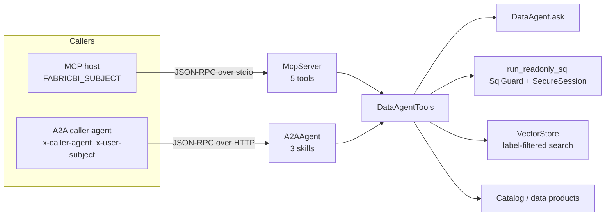

# Agent interfaces: vector store, MCP server and A2A agent

**Purpose.** Other agents and AI tools need the data agent too: a coding assistant through MCP,
an orchestrator in the agent platform through A2A, and a retrieval step that grounds answers in
the project's own definitions. All three entry points reuse the same guarded tools, so no
interface can see more than the person behind the request.

## Architecture



## How it works

### Vector store

1. `corpus()` collects one chunk per markdown section under `docs/`, one chunk per data product
   contract (description, owner, tables, freshness SLO) and one chunk per measure (description,
   DAX, synonyms).
2. Each chunk carries a sensitivity label: data product chunks take the product's label, the rest
   are General.
3. Chunks are embedded with TF-IDF over words and word pairs (deterministic, no model download).
4. `search(query, k, clearance)` scores by cosine similarity and **drops chunks above the
   caller's clearance before ranking**, so a restricted document never reaches a prompt.
   Clearance comes from roles: `pii_reader` is Highly Confidential, `finance` Confidential, any
   other role General, no role Public.

### MCP server

1. A host launches `python -m fabricbi.serve.mcp_server` with `FABRICBI_SUBJECT` set to the
   signed-in user. Identity comes from the transport, never from tool arguments.
2. The server speaks JSON-RPC 2.0 over stdio: `initialize` (protocol `2025-06-18`), `ping`,
   `tools/list`, `tools/call`.
3. Every tool's input schema has `additionalProperties: false`. Unknown tools, missing arguments
   and extra arguments get JSON-RPC error `-32602`; unparseable lines get `-32700`.
4. A refused or failed tool call is returned as a result with `isError: true` and the reason in
   `structuredContent`, so the calling model sees *why*.

| Tool | What it does |
|---|---|
| `ask_data_agent` | Plain-language question, governed answer |
| `run_readonly_sql` | SQL written by the calling agent, through the same SQL guard and secure session |
| `search_docs` | Vector search filtered by the caller's clearance |
| `describe_asset` | Catalog entry: owner, label, classified columns, lineage |
| `list_data_products` | Products, versions, owners, sensitivity and freshness SLOs |

### A2A agent

1. `GET /.well-known/agent-card.json` returns an A2A 1.0 agent card with three skills and a
   control-plane extension (owner, side-effect class `read`, allowed callers, tenants, eval
   score, required headers), the same extension the agent platform repo reads.
2. `POST /a2a` accepts `SendMessage` with a data part `{skill, input}`.
3. The agent re-checks `x-tenant-id` and `x-caller-agent` on every request (HTTP 403, code
   `-32003`), even though the platform also checks them.
4. The skill runs as the end user in `x-user-subject`, so row-level security follows the person,
   not the calling agent. A refusal comes back as `{"error": "refused", "detail": reason}`.

## Key files

| File | What it does |
|---|---|
| [`serve/vector_store.py`](../src/fabricbi/serve/vector_store.py) | Chunking, TF-IDF embedding, label-filtered search |
| [`serve/mcp_server.py`](../src/fabricbi/serve/mcp_server.py) | `TOOLS`, `DataAgentTools`, `McpServer`, stdio loop |
| [`serve/a2a.py`](../src/fabricbi/serve/a2a.py) | `agent_card()`, `A2AAgent`, HTTP server |
| [`governance/labels.py`](../src/fabricbi/governance/labels.py) | Label order and `clearance_for(roles)` |
| [`control-plane/mcp-tools.json`](../control-plane/mcp-tools.json), [`agent-card.json`](../control-plane/agent-card.json) | Exported definitions, regenerated by `export_contracts.py` and drift-checked in CI |

## Code excerpts

Clearance is applied before ranking:

<!-- excerpt: src/fabricbi/serve/vector_store.py -->
```python
        allowed = np.array([at_most(c.label, clearance) for c in self.chunks])
        scores = np.where(allowed, scores, -1.0)
```

MCP argument checking:

<!-- excerpt: src/fabricbi/serve/mcp_server.py -->
```python
            allowed = set(spec["inputSchema"]["properties"])
            missing = [r for r in spec["inputSchema"].get("required", []) if r not in args]
            if set(args) - allowed or missing:
```

A2A caller checks and end-user identity:

<!-- excerpt: src/fabricbi/serve/a2a.py -->
```python
        if h.get("x-tenant-id") not in TENANTS:
            return err(-32003, "tenant not allowed", 403)
        if h.get("x-caller-agent") not in ALLOWED_CALLERS:
            return err(-32003, "caller not allowed", 403)
```

## Configuration and parameters

| Setting | Value |
|---|---|
| `FABRICBI_SUBJECT` | MCP caller identity (unknown subjects get no roles) |
| `FABRICBI_LAKE` | Lake the servers read |
| `PORT` | A2A port when run as a module (default 8460) |
| `A2A_FABRIC_DATA_AGENT_URL` | Public URL written into the agent card |
| `ALLOWED_CALLERS` | experience-bff, underwriting-agent, care-planner, data-agent |
| `TENANTS` | fernhill |
| `search_docs.k` | 1 to 8, default 3 |

## Run it locally

```bash
python -m fabricbi.examples vector_store
python -m fabricbi.examples mcp
python -m fabricbi.examples a2a
```

<!-- example: vector_store -->
```text
indexed: every docs/*.md section, 5 data product contracts, 8 measure definitions
'How is average basket calculated?' -> top hit semantic-model/retail_sales.yaml (Measure Average Basket)
'How fresh is the live store operations data supposed to be?' -> top hit docs/agent-interfaces.md (Run it locally)
'Who owns the loyalty members data product?' with clearance General: loyalty contract returned = False
'Who owns the loyalty members data product?' with clearance Highly Confidential: loyalty contract returned = True
```

<!-- example: mcp -->
```text
initialize -> protocol 2025-06-18, server {'name': 'fabric-data-agent', 'version': '0.1.0'}
tools/list -> ['ask_data_agent', 'run_readonly_sql', 'search_docs', 'describe_asset', 'list_data_products']
ask_data_agent as north.manager -> isError=False summary='Net Sales by region: North 130,549.92'
run_readonly_sql DROP -> isError=True {'status': 'refused', 'reason': 'not_read_only', 'estimated_cost': 0}
extra argument -> error {'code': -32602, 'message': 'invalid arguments'}
```

<!-- example: a2a -->
```text
card: Fabric Data Agent, skills ['ask_sales_question', 'search_data_docs', 'describe_data_asset']
control plane: side effects read, callers ['experience-bff', 'underwriting-agent', 'care-planner', 'data-agent'], tenants ['fernhill']
experience-bff as west.manager -> 200 'Transactions by region: West 4417'
restricted measure -> 200 {'error': 'refused', 'detail': 'measure_restricted:Gross Margin'}
unknown caller -> 403 {'code': -32003, 'message': 'caller not allowed'}
unknown tenant -> 403 {'code': -32003, 'message': 'tenant not allowed'}
```

To use the servers by hand, build a lake first with `python scripts/demo.py` (it writes
`.onelake-demo/lake`), then point the servers at it:

```bash
export FABRICBI_LAKE=.onelake-demo/lake
echo '{"jsonrpc":"2.0","id":1,"method":"tools/list"}' \
  | FABRICBI_SUBJECT=west.manager@fernhill.example python -m fabricbi.serve.mcp_server
PORT=8460 python -m fabricbi.serve.a2a     # card at http://127.0.0.1:8460/.well-known/agent-card.json
```

## Tests and eval gates

| Test | Checks |
|---|---|
| `tests/test_08_mcp_a2a.py::test_mcp_initialize_and_list` | protocol version and the five tools |
| `test_mcp_tool_call_answers`, `test_mcp_refusal_is_an_error_result` | answers and `isError` refusals |
| `test_mcp_rejects_unknown_tool_and_extra_args`, `test_mcp_tool_schemas_forbid_extra_properties` | `-32602` and closed schemas |
| `test_mcp_over_stdio_subprocess` | real subprocess over stdio, North manager sees North only, bad line gets `-32700` |
| `test_agent_card_shape` | card fields and control-plane extension |
| `test_a2a_answers_with_end_user_rls`, `test_a2a_refuses_unknown_tenant_or_caller`, `test_a2a_validates_skill_and_input`, `test_a2a_refusal_is_reported` | A2A behaviour |
| `test_a2a_over_http` | real HTTP server: card and `SendMessage` |
| `tests/test_09_governance_ops.py::test_vector_store_filters_by_label` | the loyalty contract is hidden at General and returned at Highly Confidential |
| `tests/test_09_governance_ops.py::test_label_order_and_clearance` | clearance from roles |
| `tests/test_10_repo.py::test_agent_card_eval_score_matches_baseline` | the card's `eval_score` equals the NL-to-SQL baseline; `export_contracts.py --check` in CI catches any other drift in the card or tool list |

Eval gate: `retrieval_hit_at_3` at least 0.8 on 10 questions in
[`evals/gold/retrieval.jsonl`](../evals/gold/retrieval.jsonl). The agent card's `eval_score`
comes from `evals/baseline.json`.

## Guardrails, security and governance

- The MCP and A2A layers add no new data access; they call the same guarded tools as the agent.
- Identity is never taken from tool arguments.
- Every tool is read-only (`readOnlyHint: true`, side-effect class `read`).
- Retrieval respects sensitivity labels, so RAG cannot leak a Highly Confidential contract into a
  General user's prompt.

## Observability

Tool calls that reach the data agent produce `data_agent.ask` spans and `fabricbi.agent.queries`
counts; `run_readonly_sql` refusals are counted with their reason. A2A responses echo the
caller's `traceparent` so the platform can join its trace with this one.

## Failure modes

| Failure | Response |
|---|---|
| Unknown tool, missing or extra argument | JSON-RPC error `-32602` |
| Line is not JSON | `-32700` (MCP and A2A) |
| Unknown method | `-32601` |
| Policy refusal | MCP `isError: true` with reason; A2A `{"error": "refused", "detail": ...}` |
| Unknown tenant or caller agent | HTTP 403, `-32003` |
| Unknown end user | No roles: every data tool refuses with `no_role` |

## On real Fabric

| Here | In Azure |
|---|---|
| stdio MCP server | Hosted MCP server behind Azure API Management or the MCP gateway in the integration platform repo, which validates the Entra ID token and passes the user subject |
| A2A HTTP server | Container App registered in the agent platform's directory, called through its A2A client with mTLS or Entra ID between services |
| TF-IDF `VectorStore` | Azure AI Search or an Eventhouse vector table over OneLake, with Foundry embeddings; `embed` is the one function to swap |
| Labels on chunks | Purview sensitivity labels carried into the index as a filter field |

## Limitations

- TF-IDF matches words, not meaning; a real embedding model would handle paraphrases better.
- The MCP server supports tools only (no resources or prompts) and stdio only.
- The A2A agent has no streaming and no task lifecycle; every message is answered synchronously.
- Tenant and caller lists are constants in code, not read from the platform's registry.
