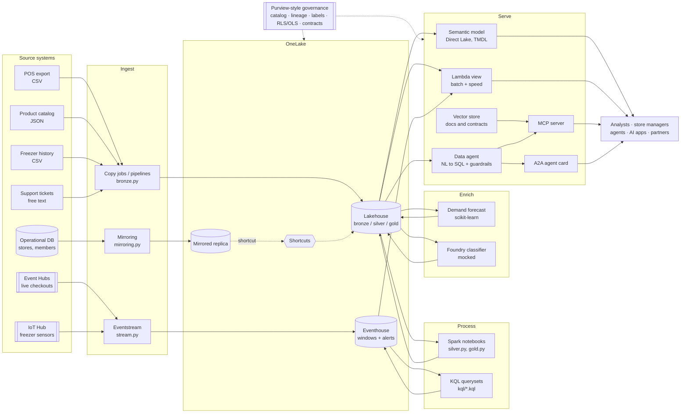
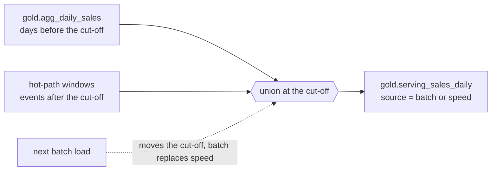
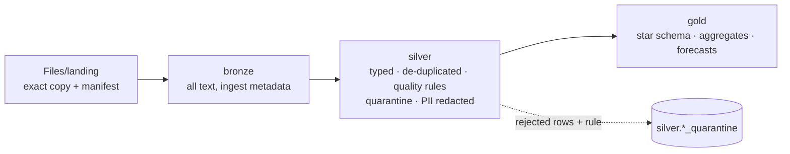
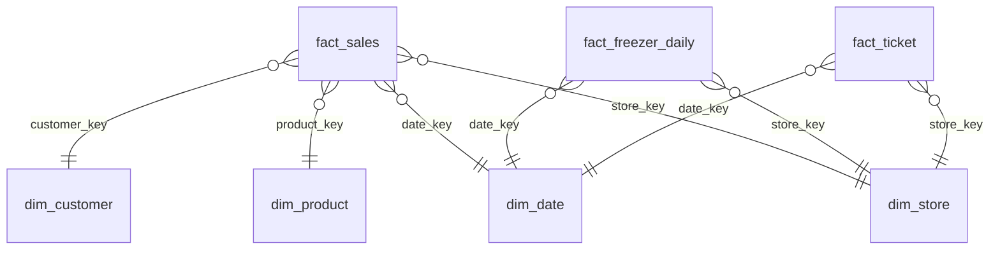

# Architecture

The build follows the shape most Fabric analytics estates converge on: land everything in one
lake, keep a fast path for what is happening now and a careful path for what happened, and put
one governed serving layer in front of people and agents. Inspired by Microsoft's Fabric
enterprise BI reference patterns; the design, names and code here are my own.

This page is the overview. Each component has its own page (see the [docs index](README.md)), and
the [implementation guide](implementation-guide.md) walks through running and deploying it.

## End to end

## Two speeds, one serving view (Lambda)

| Path | Latency | What it is good at | Code |
|---|---|---|---|
| Hot (speed layer) | seconds to minutes | live tiles, alerts, "how is today going" | [`hotpath/`](../src/fabricbi/hotpath), [`kql/`](../kql) |
| Cold (batch layer) | once a day | corrected, conformed history; the star schema; ML features | [`coldpath/`](../src/fabricbi/coldpath) |
| Serving | on read | one table that shows batch history and today's partial numbers without double counting | [`lambda_view.py`](../src/fabricbi/lambda_view.py) |

## Medallion layers

| Layer | Contract | Who reads it |
|---|---|---|
| bronze | none beyond ingest metadata; kept for replay | data engineers |
| silver | YAML schema contracts on `pos_lines` and `products`; quality rules on every table, with a 2% quarantine gate | data engineers, data scientists |
| gold | a schema contract on every table, checked before each write | the semantic model, the data agent, ML, partners |

## Gold model (star schema)

## Mapping to Fabric and Azure items

| Concept | Fabric / Azure item | Offline stand-in |
|---|---|---|
| Streaming ingest | Event Hubs, IoT Hub, Fabric Eventstream | `hotpath.stream.simulate` |
| Real-time store | Eventhouse (KQL database) | Parquet under `eh_retail/` + `hotpath.windows` |
| Batch ingest | Data Factory pipelines, copy job | `coldpath.bronze.BronzeIngest` |
| Database replication | Fabric Mirroring | `coldpath.mirroring` on SQLite |
| Lake storage | OneLake Lakehouse (Delta) | Parquet under `lh_retail/Tables` |
| Shortcuts | OneLake internal and external shortcuts | `Lakehouse.add_shortcut` |
| Transform | Spark notebooks, T-SQL, Dataflow Gen2 | pandas in `silver.py` and `gold.py`; Fabric notebook items in [`fabric/`](../fabric) |
| ML | Fabric data science or Azure ML | scikit-learn in `enrich/forecast.py` |
| LLM enrichment | Microsoft Foundry model deployment | `enrich/foundry_mock.py` |
| BI | Power BI semantic model in Direct Lake mode | YAML + generated TMDL in [`semantic-model/`](../semantic-model) |
| Conversational analytics | Fabric data agent | `serve/data_agent.py` |
| Agent interfaces | MCP server, A2A | `serve/mcp_server.py`, `serve/a2a.py` |
| Governance | Microsoft Purview | `governance/` |
| Monitoring | Azure Monitor, Log Analytics, App Insights | `observability/`, [`kql/monitoring`](../kql/monitoring) |
