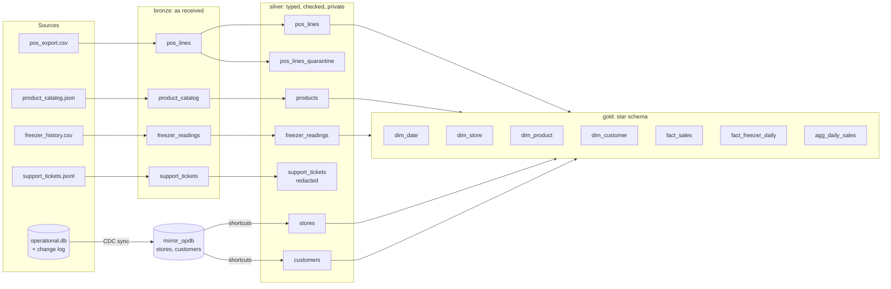

# Cold path: medallion Lakehouse, mirroring and data quality

**Purpose.** The cold path owns the *complete and corrected* history. It lands batch files and an
operational database in the lake, cleans and checks them, and builds the star schema that the
semantic model, the forecast and the data agent read. It runs once per batch (nightly in a real
estate) and is safe to re-run.

## Architecture



## How it works

1. **Copy into bronze** ([`bronze.py`](../src/fabricbi/coldpath/bronze.py)). Each source file is
   copied into `Files/landing/<source>/` and recorded in a manifest by SHA-256 of its content.
   A file whose content was already landed is skipped, and if nothing new arrived the whole step
   returns `{"skipped": 4}`. Bronze reads every column as text and adds `_row_hash`,
   `_source_file` and `_batch_id`, so a malformed value never stops ingest.
2. **Mirror the operational database** ([`mirroring.py`](../src/fabricbi/coldpath/mirroring.py)).
   Every insert, update and delete in the source is written to a change log with a log sequence
   number (LSN) in the same transaction. The replica reads the changes after its checkpoint,
   applies them in order (upsert by key, delete by key), writes the tables and only then saves
   the checkpoint. Replication lag is the number of change-log entries not yet applied.
3. **Shortcuts, not copies.** Silver reads the mirrored stores and members through two internal
   shortcuts (`opdb_stores`, `opdb_customers`), so there is one physical copy of member data.
4. **Silver** ([`silver.py`](../src/fabricbi/coldpath/silver.py)) casts types, removes duplicate
   POS lines, applies row rules (first failing rule wins), writes failing rows to a quarantine
   table with the rule name, flattens the catalog JSON, and redacts emails and phone numbers from
   ticket text.
5. **Contracts.** Every silver and gold write is validated against its YAML contract
   ([`contracts.py`](../src/fabricbi/coldpath/contracts.py)). A violation raises `ContractError`
   before the table is replaced.
6. **Quality gate.** `quality.enforce()` stops the run if any table quarantined more than 2% of
   its rows, so a bad batch never reaches gold.
7. **Gold** ([`gold.py`](../src/fabricbi/coldpath/gold.py)) builds four dimensions with dense
   surrogate keys assigned in natural-key order (rebuilds give the same keys), a guest member
   with key -1, the sales fact at line grain, a daily freezer summary and a daily aggregate per
   store and category.

## Key files

| File | What it does |
|---|---|
| [`coldpath/lakehouse.py`](../src/fabricbi/coldpath/lakehouse.py) | OneLake stand-in: `Tables/<layer>__<table>.parquet`, table metadata, shortcuts |
| [`coldpath/bronze.py`](../src/fabricbi/coldpath/bronze.py) | Idempotent landing and bronze load |
| [`coldpath/mirroring.py`](../src/fabricbi/coldpath/mirroring.py) | `OperationalDb` (source with change log) and `MirrorReplica` (checkpointed apply) |
| [`coldpath/quality.py`](../src/fabricbi/coldpath/quality.py) | Rules, quarantine split, `DqReport`, `enforce()` |
| [`coldpath/contracts.py`](../src/fabricbi/coldpath/contracts.py) | Contract validation and change compatibility |
| [`coldpath/silver.py`](../src/fabricbi/coldpath/silver.py) | Silver transforms and redaction |
| [`coldpath/gold.py`](../src/fabricbi/coldpath/gold.py) | Star schema and aggregate |
| [`contracts/schemas/`](../contracts/schemas/README.md) | One contract per table |
| [`pipeline.py`](../src/fabricbi/pipeline.py) | `run_all()` runs the steps in order |

## Code excerpts

Idempotent landing:

<!-- excerpt: src/fabricbi/coldpath/bronze.py -->
```python
        m = self.manifest()
        digest = _sha(path)
        if digest in m:
            return False
        shutil.copy2(path, self.ctx.lake.files_dir("landing", source) / path.name)
```

Applying the change log (replaying an upsert is harmless, which is what makes a crash safe):

<!-- excerpt: src/fabricbi/coldpath/mirroring.py -->
```python
        for lsn, tbl, op, key, payload in changes:
            if op == "delete":
                state[tbl].pop(key, None)
                stats.deletes += 1
            else:
                state[tbl][key] = payload  # upsert by key: replaying an insert or update is harmless
```

The POS rules in silver:

<!-- excerpt: src/fabricbi/coldpath/silver.py -->
```python
        rules = [
            quality.in_range("qty", 1, 50),
            quality.references("sku", set(products.sku), "products"),
            quality.references("store_id", set(stores.store_id), "stores"),
            quality.in_range("unit_price", 0.01, 500),
        ]
```

Every gold table goes through its contract:

<!-- excerpt: src/fabricbi/coldpath/gold.py -->
```python
def write_contracted(ctx: RunContext, name: str, df: pd.DataFrame, inputs: list[str], process: str) -> None:
    v = contracts.validate(df, contracts.load(f"gold.{name}"))
    if v:
        raise ContractError(f"gold.{name}: " + "; ".join(f"{x.column}:{x.rule}" for x in v[:5]))
    ctx.write("gold", name, df, inputs, process)
```

## Silver rules

| Table | Rule | On failure |
|---|---|---|
| pos_lines | same transaction, line, SKU and quantity seen twice | dropped, counted as `dedupe:exact_duplicate` |
| pos_lines | quantity between 1 and 50 | quarantined (`range:qty`) |
| pos_lines | SKU exists in the catalog | quarantined (`fk:sku->products`) |
| pos_lines | store exists | quarantined (`fk:store_id->stores`) |
| pos_lines | unit price between 0.01 and 500 | quarantined (`range:unit_price`) |
| products | price stored as text | coerced, counted as `warn:price_as_text` |
| products | missing category | kept as `Unassigned`, counted as `warn:category_unassigned` (its sales are not lost) |
| freezer_readings | temperature between -40 and 15 C | quarantined |
| support_tickets | emails and phone numbers | redacted before the row is written; the raw text column is not carried |

## Configuration and parameters

| Setting | Where | Default |
|---|---|---|
| Quarantine-rate gate | `quality.enforce(max_quarantine_rate=0.02)` | 2% per table (matches the `retail-sales` product's `max_quarantine_rate`) |
| Lake location | `FABRICBI_LAKE` (`paths.lake_root()`) | `.onelake/` in the repo for scripts; tests use a temporary folder |
| History length | `run_all(workdir, days=56)` | 56 days |
| Contracts | `contracts/schemas/<layer>.<table>.yaml` | one per silver and gold table |

## Run it locally

```bash
python -m fabricbi.examples coldpath     # table row counts and quality reports after a full run
python -m fabricbi.examples mirroring    # partial sync, catch-up, replay, source update
```

<!-- example: coldpath -->
```text
bronze:
  bronze.freezer_readings             32,256 rows
  bronze.pos_lines                    59,725 rows
  bronze.product_catalog                  40 rows
  bronze.support_tickets                 120 rows
silver:
  silver.customers                       299 rows
  silver.freezer_readings             32,256 rows
  silver.pos_lines                    59,720 rows
  silver.pos_lines_quarantine              2 rows
  silver.products                         40 rows
  silver.stores                           12 rows
  silver.support_tickets                 120 rows
gold:
  gold.agg_daily_sales                 4,603 rows
  gold.dim_customer                      300 rows
  gold.dim_date                           57 rows
  gold.dim_product                        40 rows
  gold.dim_store                          12 rows
  gold.fact_freezer_daily              1,344 rows
  gold.fact_sales                     59,720 rows
  gold.fact_ticket                       120 rows
  gold.forecast_sales                  1,176 rows
  gold.serving_sales_daily               684 rows
quality reports:
  silver.products          in     40  out     40  quarantined 0  {'warn:price_as_text': 1, 'warn:category_unassigned': 1}
  silver.pos_lines         in 59,725  out 59,720  quarantined 2  {'range:qty': 1, 'fk:sku->products': 1, 'dedupe:exact_duplicate': 3}
  silver.freezer_readings  in 32,256  out 32,256  quarantined 0  {}
  silver.support_tickets   in    120  out    120  quarantined 0  {}
mirror lag after sync: 0
shortcuts: ['opdb_customers', 'opdb_stores']
```

<!-- example: mirroring -->
```text
partial sync: applied 300, checkpoint lsn 300, lag 15
catch-up sync: applied 15 (inserts 12, updates 2, deletes 1), lag 0
replay: applied 0, tables {'stores': 12, 'customers': 299}
after a source update: Fernhill Alder Falls Market
```

Silver keeps 299 members because the generator deleted `C00300` at the source; gold has 300
because it adds the guest member (key -1).

## Tests and eval gates

| Test file | Covers |
|---|---|
| [`tests/test_02_bronze_mirroring.py`](../tests/test_02_bronze_mirroring.py) | Bronze keeps every source row and the three metadata columns; a second ingest is skipped; CDC applies deletes; replay applies nothing; partial sync reports lag; the checkpoint survives a restart; shortcuts resolve |
| [`tests/test_03_contracts_quality.py`](../tests/test_03_contracts_quality.py) | Every contract loads; seven gold tables satisfy their contracts; validation catches nulls, duplicate keys, bad values and ranges; compatibility classes; quarantine keeps rule names; the gate stops a bad batch; tickets carry no PII |
| [`tests/test_04_gold.py`](../tests/test_04_gold.py) | Every fact key resolves to a dimension row; fact rows equal clean silver rows; guest member exists and the deleted member does not; the aggregate reconciles to the fact; the calendar is contiguous; the warm afternoon shows in the daily freezer summary; lineage is recorded |

The `catalog_findings` eval gate (0 allowed) fails if a gold table is written without an owner or
label in the catalog.

## Guardrails, security and governance

- Personal data: ticket text is redacted in silver; member email and phone stay in
  `gold.dim_customer`, which is Highly Confidential and masked for everyone without `pii_reader`
  ([data-agent.md](data-agent.md)).
- Every write records lineage `(process, inputs, outputs)` and table metadata, which the catalog
  and freshness checks read ([governance.md](governance.md)).
- Finance-only columns (`unit_cost`, `cost_amount`) are produced here and hidden at serving time.

## Observability

Spans `bronze.ingest`, `mirroring.sync`, `silver.build` and `gold.build`; counters
`fabricbi.rows.written` (per table and layer) and `fabricbi.rows.quarantined`. The quality reports
are saved as `_dq_reports.json` next to the lake.

## Failure modes

| Failure | What happens | Where |
|---|---|---|
| The same file arrives twice | Skipped by content hash; no duplicate rows | `BronzeIngest.land` |
| Crash after applying changes but before saving the checkpoint | Next sync re-applies the same changes with the same result | `MirrorReplica.sync` |
| Source deletes a member who has sales | Sales keep `customer_key = -1` (guest) | `gold.py` |
| Bad rows in a batch | Quarantined with the rule name; run stops if more than 2% | `quality.apply_rules`, `quality.enforce` |
| A transform produces the wrong shape | `ContractError` before the table is replaced | `silver._check`, `gold.write_contracted` |
| Catalog field changes type (price as text) | Coerced and counted as a warning | `silver.py` |
| Schema change to a contract | `compatibility()` says breaking or additive; the product's version is bumped with `bump_for` | `contracts.py`, `products.py` |

## On real Fabric

| Here | In Fabric |
|---|---|
| `BronzeIngest` | Data Factory pipeline or copy job into `Files/landing`, then the `nb_bronze_ingest` notebook |
| Parquet under `lh_retail/Tables` | Delta tables in the `lh_retail` Lakehouse (schemas enabled) |
| `OperationalDb` + `MirrorReplica` | Fabric Mirroring of Azure SQL Database (or Cosmos DB), which reads the change feed and keeps a read-only replica in OneLake |
| `add_shortcut` | OneLake shortcuts |
| `silver.py`, `gold.py` | The `nb_silver` and `nb_gold` PySpark notebooks in [`fabric/workspace`](../fabric/workspace/README.md), same rules and table names |
| Contracts in pandas | The same YAML can drive checks in the notebooks or a Great Expectations style suite |

## Limitations

- The pandas code and the PySpark notebooks are two implementations of the same rules; the
  notebooks have not been executed on a Fabric capacity.
- Full rebuild each run: there is no incremental (merge) load into silver and gold yet.
- The mirroring simulation covers inserts, updates and deletes on two tables; it does not model
  schema changes in the source or initial snapshot plus streaming at Fabric's scale.
