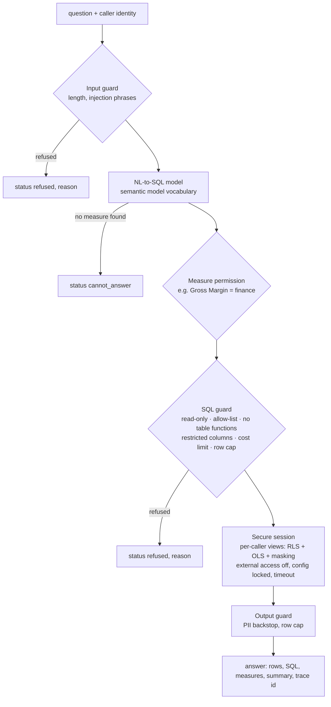

# The data agent: natural language over the gold model, with guardrails

The data agent answers questions like "top 3 stores by revenue in the last 7 days" from the gold
star schema. It plays the role of a Fabric data agent item, and it is reachable three ways: in
process (`DataAgent.ask`), as an MCP server and as an A2A agent.

## Request path

## Layers of protection

| Layer | Control | Why it is there |
|---|---|---|
| Identity | Subject resolved to roles and regions (Entra ID group claims in Azure; [`governance/principals.yaml`](../governance/principals.yaml) offline). Unknown subjects get nothing. | The agent acts for a person, never with its own broad rights. |
| Input | Length cap; phrases that try to override instructions or smuggle SQL are refused. | Cheap first filter; not relied on alone. |
| Semantics | The model only maps to measures and dimensions defined in the semantic model; finance-only measures need the finance role. | Answers use the same definitions as the Power BI reports. |
| SQL | One SELECT; only the eight gold views; no `base` or `information_schema`; no file, system or catalog functions; no finance-only columns for other roles; estimated rows scanned under the role's limit (a cross join multiplies); LIMIT forced to 200 or less. | A steered or wrong model output still cannot write, read files or run a runaway query. |
| Session | A fresh in-memory DuckDB per question: gold loaded into a hidden schema, one view per table with the caller's region filter, finance columns dropped, email and phone masked unless `pii_reader`. Then file and network access are switched off and settings are locked. A timer interrupts long queries. | Even SQL that passed every check sees only the caller's rows and columns. |
| Output | Email and phone patterns masked again; row cap. | Backstop if a new column ever carries personal data. |
| Telemetry | Every question is a span with the outcome and reason; refusals are counted by reason. | Shows attacks and false refusals on a dashboard ([`kql/monitoring/agent_queries.kql`](../kql/monitoring/agent_queries.kql)). |

## Row-level security by region

Store managers see their region only. The same question asked by two people gives two answers:

| Caller | Question | Result |
|---|---|---|
| `exec.viewer@fernhill.example` (all regions) | net sales by region | four rows |
| `west.manager@fernhill.example` | net sales by region | one row: West |
| `west.manager@fernhill.example` | gross margin by region | refused: `measure_restricted:Gross Margin` |
| `finance.partner@fernhill.example` | gross margin by category | answered |

## MCP tools

| Tool | What it does |
|---|---|
| `ask_data_agent` | plain-language question, governed answer |
| `run_readonly_sql` | SQL written by the calling agent, through the same guard and session |
| `search_docs` | vector search over docs, data product contracts and measure definitions, filtered by the caller's clearance |
| `describe_asset` | catalog entry with owner, label, classified columns and lineage |
| `list_data_products` | data products, owners, sensitivity and freshness SLOs |

The server speaks JSON-RPC 2.0 over stdio (`initialize`, `tools/list`, `tools/call`). Identity
comes from the launching host (`FABRICBI_SUBJECT`), never from tool arguments. Tool definitions
are exported to [`control-plane/mcp-tools.json`](../control-plane/mcp-tools.json) and drift-checked
in CI.

## A2A

[`control-plane/agent-card.json`](../control-plane/agent-card.json) is an A2A 1.0 card with the
same control-plane extension the agent platform repo uses (owner, side-effect class `read`,
allowed callers, tenants, eval score). The endpoint accepts `SendMessage` with a data part
`{skill, input}`, checks the tenant and caller headers itself and runs the skill as the end user in
`x-user-subject`, so a calling agent cannot widen what the person may see.

## Limits

The NL-to-SQL model is a deterministic parser standing in for a Foundry model. Its eval score
shows the harness and guards work on the question set; it says nothing about how a real model
would phrase SQL. The cost estimate is a row-count heuristic, not a query planner.
