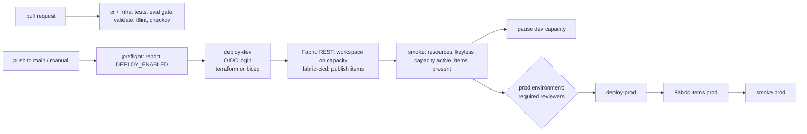

# Deployment: GitHub Actions, OIDC, dev -> prod

Deployment runs on **GitHub Actions**. The Azure resources can be created with **Terraform or
Bicep** (the `deploy_tool` input), and Azure login uses **OpenID Connect**: GitHub issues a
short-lived token, Entra ID trusts it through a federated credential, and no client secret is
stored anywhere.

> **Status: nothing has been deployed.** Every deploy job is gated behind the repository variable
> `DEPLOY_ENABLED`, which is **not set**. On each push to `main` the deploy workflow reports the
> gate and skips its jobs. The pull-request checks (lint, tests, eval gate, Terraform validate and
> test, tflint, checkov, Bicep build) run for real on every change.

## Two layers, two mechanisms

A Fabric platform is deployed in two different ways, and the pipeline keeps them apart:

| Layer | What | How it is deployed |
|---|---|---|
| Azure resources | Fabric capacity, Event Hubs, IoT Hub, landing storage, Key Vault, Log Analytics, Purview (prod), managed identity, budget | Terraform ([`infra/terraform`](../infra/terraform)) or Bicep ([`infra/main.bicep`](../infra/main.bicep)) through Azure Resource Manager |
| Fabric workspace items | Workspace, Lakehouse, Eventhouse + KQL database, notebooks, semantic model | Not ARM resources. The workspace is created with the Fabric REST API (`POST /v1/workspaces` with a `capacityId`) and the item definitions in [`fabric/workspace/`](../fabric/workspace) are published with [fabric-cicd](https://microsoft.github.io/fabric-cicd/) by [`scripts/publish_fabric_items.py`](../scripts/publish_fabric_items.py) |

Keeping item definitions as files (the same format Fabric Git integration writes) means a
reviewer sees a notebook or measure change as a diff in the pull request, and the same definitions
go to dev and prod with environment values swapped by
[`fabric/workspace/parameter.yml`](../fabric/workspace/parameter.yml). See
[ADR 0006](adr/0006-fabric-items-via-rest-and-fabric-cicd.md).

## Workflows

| Workflow | Trigger | What it does |
|---|---|---|
| [`ci.yml`](../.github/workflows/ci.yml) | push to `main`, pull requests | Ruff, generated files current, secrets scan, pytest, end-to-end demo, eval gate, Bicep build |
| [`infra.yml`](../.github/workflows/infra.yml) | push to `main`, pull requests, manual | `terraform fmt -check`, `validate`, `terraform test` with mocked providers, tflint, checkov. `plan` runs only if the OIDC variables exist |
| [`deploy.yml`](../.github/workflows/deploy.yml) | push to `main`, manual | Dev: provision, Fabric workspace + items, smoke tests, pause the capacity. Prod: the same after reviewer approval. Gated by `DEPLOY_ENABLED` |
| [`teardown.yml`](../.github/workflows/teardown.yml) | manual only | Destroys one environment with the tool that created it. Gated, runs in the matching environment (so prod needs approval) and needs the environment name typed again |

**Smoke tests** check that the resource group has its resources, that no Event Hubs namespace
allows SAS keys and no storage account allows shared keys, that the Fabric capacity is `Active`,
and that the expected items exist in the workspace.

**Pausing.** A Fabric capacity bills by the hour while it is running, whether or not anything
uses it. The dev job pauses the capacity after its smoke tests (input `pause_dev_capacity`,
default on). Resume it from the portal, or with the Azure CLI Fabric extension
(`az extension add --name microsoft-fabric`, then
`az fabric capacity resume --resource-group <rg> --capacity-name <name>`), when you need it. The cost table is in [cost-estimate.md](cost-estimate.md).

## One-time setup (when a subscription exists)

Nothing below has been done yet; it is the checklist for the first real deployment.

1. **Identities.** One Entra app registration (or user-assigned managed identity) per environment,
   for example `gh-fabricbi-dev` and `gh-fabricbi-prod`.
2. **Federated credentials**, issuer `https://token.actions.githubusercontent.com`, audience
   `api://AzureADTokenExchange`, subjects:
   - `repo:jagadishmazure-jpg/Jagadish-fabric-enterprise-bi:environment:dev`
   - `repo:jagadishmazure-jpg/Jagadish-fabric-enterprise-bi:environment:prod`
   - optional read-only plan identity: `repo:jagadishmazure-jpg/Jagadish-fabric-enterprise-bi:pull_request`
3. **RBAC, least privilege.** `Contributor` on the environment's resource group or subscription,
   `Role Based Access Control Administrator` limited by condition to the data roles the stack
   assigns, and `Storage Blob Data Contributor` on the Terraform state container.
4. **Fabric tenant settings** (Fabric admin portal). Allow service principals to use Fabric APIs,
   scoped to a security group that contains the two deploy identities. Add each identity as a
   capacity administrator through the `FABRIC_ADMINS` variable, so it can assign the workspace.
   Note the capacity administrator list is validated as UPNs or object ids.
5. **No capacity yet?** A Fabric trial capacity works for a first walkthrough. Set
   `FABRIC_CAPACITY_ID` to its id and `deploy_fabric_capacity = false` (Terraform) or
   `deployFabricCapacity: false` (Bicep), and the pipeline publishes into the trial instead of
   creating an F SKU.
6. **Terraform state.** Create the state storage account and container once
   (commands in [`infra/terraform/README.md`](../infra/terraform/README.md)).
7. **GitHub Environments** `dev` and `prod`. On `prod`: required reviewers, prevent self-review,
   deployment branches limited to `main`.
8. **Variables** (no secrets): `AZURE_CLIENT_ID`, `AZURE_TENANT_ID`, `AZURE_SUBSCRIPTION_ID` per
   environment; `TFSTATE_RESOURCE_GROUP`, `TFSTATE_STORAGE_ACCOUNT`, `FABRIC_ADMINS` at repository
   level (optional `AZURE_LOCATION`, `DEPLOY_TOOL`, `FABRIC_CAPACITY_ID`).
9. **Turn it on** by setting `DEPLOY_ENABLED` to `true`, only after steps 1 to 8 are reviewed.

## After the first deployment

- Run the notebooks in order (`nb_bronze_ingest`, `nb_silver`, `nb_gold`) or schedule them with a
  pipeline; point the Eventstream at the Event Hubs namespace and the KQL database.
- Bind the semantic model to the Lakehouse SQL endpoint (Direct Lake) and apply the roles from
  [`governance/access-policy.yaml`](../governance/access-policy.yaml).
- Register the Lakehouse and Eventhouse as Purview data sources so scans fill the real catalog.

## Rollback and teardown

- **Rollback:** re-run `deploy.yml` from an earlier commit. Item definitions are in Git, so the
  previous notebook or measure version is republished as it was.
- **Teardown:** `teardown.yml` removes the Azure resources. The Fabric workspace is not an ARM
  resource, so the job prints the REST call or portal step that removes it.

## At a client

A real engagement starts from the client's landing zone, not these defaults: their subscription
layout, network, naming and tag policy, the IaC tool their platform team runs, and their Fabric
tenant settings (which are often locked down). The first conversations are about data: which
sources may be mirrored, where data may live, which columns are personal data, and who owns each
data product. Only then does the pipeline get pointed at their GitHub organization with
per-environment OIDC credentials and approvers that match their change process.
