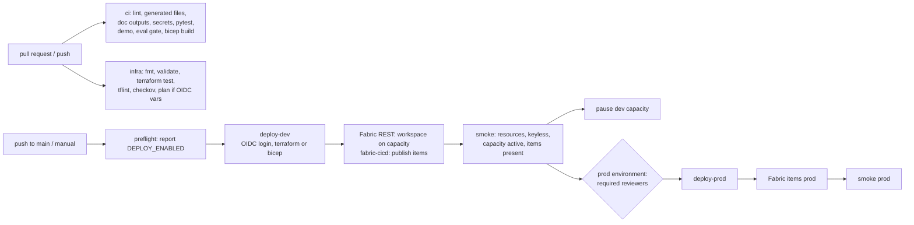

# Deployment: GitHub Actions workflows, OIDC, dev to prod

**Purpose.** Every change is checked by CI, and the same repository can deploy the platform to a
dev and a prod environment with one workflow, using either Terraform or Bicep, with no stored
secrets and a human approval before prod. This page explains the four workflows and the deploy
script. The step-by-step first deployment is in the [implementation guide](implementation-guide.md).

> **Status: nothing has been deployed.** Every deploy job is gated behind the repository variable
> `DEPLOY_ENABLED`, which is **not set**. On each push to `main` the deploy workflow reports the
> gate and skips its jobs. The pull-request checks (lint, tests, eval gate, Terraform validate and
> test, tflint, checkov, Bicep build) run for real on every change.

## Architecture



## Two layers, two mechanisms

| Layer | What | How it is deployed |
|---|---|---|
| Azure resources | Fabric capacity, Event Hubs, IoT Hub, landing storage, Key Vault, Log Analytics, App Insights, Purview (prod), budget | Terraform ([`infra/terraform`](../infra/terraform/README.md)) or Bicep ([`infra/main.bicep`](../infra/main.bicep)) through Azure Resource Manager ([infrastructure.md](infrastructure.md)) |
| Fabric workspace items | Workspace, Lakehouse, Eventhouse, KQL database, notebooks, semantic model | Not ARM resources. The workspace is created with the Fabric REST API (`POST /v1/workspaces` with a `capacityId`) and the definitions in [`fabric/workspace/`](../fabric/workspace/README.md) are published with fabric-cicd by [`scripts/publish_fabric_items.py`](../scripts/publish_fabric_items.py) ([fabric-items.md](fabric-items.md)) |

Item definitions are files in the format Fabric Git integration writes, so a notebook or measure
change is a reviewable diff, and the same definitions go to dev and prod with values swapped by
[`fabric/workspace/parameter.yml`](../fabric/workspace/parameter.yml). See
[ADR 0006](adr/0006-fabric-items-via-rest-and-fabric-cicd.md).

## How it works

### `ci.yml` (every pull request and push to `main`)

| Job | Steps |
|---|---|
| `lint` | `ruff check`, `ruff format --check`, `export_contracts.py --check` (agent card, MCP tools, TMDL, KQL schema), `cost_report.py --check`, `model_card.py --check`, `doc_outputs.py --check`, `secrets_scan.py` |
| `test` | `pytest -q`, `scripts/demo.py`, `run_evals.py --out evals-out` (fails on any gate or regression), uploads the eval report |
| `bicep` | installs the Bicep CLI and runs `bicep build infra/main.bicep` (compile only) |

### `infra.yml` (every pull request and push to `main`, or manual)

| Job | Steps |
|---|---|
| `terraform` | `terraform fmt -check -recursive`, `init -backend=false`, `validate`, `terraform test` (mocked providers, no Azure) |
| `tflint` | `tflint --init`, then `tflint --call-module-type=all` with the azurerm ruleset |
| `checkov` | `checkov -d infra/terraform --config-file .checkov.yaml`; findings not listed in the config fail the job |
| `plan` | pull requests and manual runs only; plans dev with local state **only if** the three `AZURE_*` variables exist, otherwise reports that it was skipped |

### `deploy.yml` (push to `main` or manual)

1. `preflight` writes the gate state to the job summary. All other jobs have
   `if: vars.DEPLOY_ENABLED == 'true'`.
2. `deploy-dev` runs in the `dev` GitHub Environment with `id-token: write`, logs in with
   `azure/login` (OIDC), then calls [`.github/scripts/deploy.sh`](../.github/scripts/deploy.sh):
   `provision` (Terraform apply with `envs/dev.tfvars`, or `az deployment group create` with the
   Bicep parameters), `fabric` (find or create workspace `ws-fabricbi-dev` on the capacity and
   publish items), `smoke`, and `suspend` (pause the dev capacity; input `pause_dev_capacity`,
   default on).
3. `deploy-prod` needs `deploy-dev`, runs in the `prod` environment (required reviewers) and
   repeats provision, fabric and smoke with prod values. A manual run can stop after dev with
   `promote_to_prod: false`.

Manual inputs: `deploy_tool` (terraform or bicep), `promote_to_prod`, `pause_dev_capacity`,
`location` (default eastus2).

### `teardown.yml` (manual only)

Runs `deploy.sh destroy` for one environment with the tool that created it. It is gated by
`DEPLOY_ENABLED`, runs in the matching environment (so prod teardown needs approval) and only
starts if the `confirm` input repeats the environment name.

## Key files

| File | What it does |
|---|---|
| [`.github/workflows/ci.yml`](../.github/workflows/ci.yml) | Application CI |
| [`.github/workflows/infra.yml`](../.github/workflows/infra.yml) | Infrastructure CI |
| [`.github/workflows/deploy.yml`](../.github/workflows/deploy.yml) | Gated dev to prod deployment |
| [`.github/workflows/teardown.yml`](../.github/workflows/teardown.yml) | Gated, confirmed teardown |
| [`.github/scripts/deploy.sh`](../.github/scripts/deploy.sh) | `provision`, `fabric`, `smoke`, `suspend`, `destroy` |
| [`scripts/publish_fabric_items.py`](../scripts/publish_fabric_items.py) | fabric-cicd publish of the five item types |
| [`.checkov.yaml`](../.checkov.yaml) | Checkov configuration and the documented skips |

## Code excerpts

The gate on every deploy job:

<!-- excerpt: .github/workflows/deploy.yml -->
```yaml
  deploy-dev:
    needs: [preflight]
    if: vars.DEPLOY_ENABLED == 'true'
    runs-on: ubuntu-latest
    environment: dev
```

The smoke test refuses key-based access:

<!-- excerpt: .github/scripts/deploy.sh -->
```bash
  local_auth=$(az eventhubs namespace list -g "$RESOURCE_GROUP" --query "[?disableLocalAuth!=\`true\`] | length(@)" -o tsv)
  [[ "$local_auth" == "0" ]] || { echo "::error::an Event Hubs namespace allows SAS keys"; exit 1; }
```

## Configuration and parameters

| Variable (GitHub, no secrets) | Scope | Used by |
|---|---|---|
| `DEPLOY_ENABLED` | repository | deploy and teardown gate |
| `AZURE_CLIENT_ID`, `AZURE_TENANT_ID`, `AZURE_SUBSCRIPTION_ID` | per environment (and repository for `plan`) | OIDC login |
| `TFSTATE_RESOURCE_GROUP`, `TFSTATE_STORAGE_ACCOUNT` | repository | Terraform backend |
| `FABRIC_ADMINS` | repository | capacity administrators (UPNs or object ids, comma separated) |
| `FABRIC_CAPACITY_ID` | optional | publish into an existing or trial capacity |
| `AZURE_LOCATION`, `DEPLOY_TOOL` | optional | defaults eastus2 and terraform |

## Run it locally

The CI steps run on a laptop with `make check` (Python side), `make terraform` and `make bicep`.
The deploy script can be read and dry-checked but needs an Azure login to do anything:

```bash
make check
bash -n .github/scripts/deploy.sh && echo "deploy.sh parses"
```

Real output of the gate on a push to `main` (deploy workflow, preflight job log):

```text
##[notice]Deployment disabled (repository variable DEPLOY_ENABLED is not 'true'); deploy jobs are skipped.
```

## Tests and eval gates

`tests/test_10_repo.py::test_workflows_gate_deploy_and_use_oidc` fails if any deploy job loses
the `DEPLOY_ENABLED` condition or `id-token: write`, if prod stops using the `prod` environment,
if any workflow mentions a client secret, or if teardown stops requiring confirmation.
`test_generated_files_are_current` runs the same `--check` scripts as CI. The eval gate in
`run_evals.py` is the release gate for the agent, ticket classifier, hot path and forecast.

## Guardrails, security and governance

- OIDC only: short-lived tokens, a federated credential per GitHub Environment, no client
  secret anywhere (enforced by the test above and by `secrets_scan.py`).
- `permissions: contents: read` by default; `id-token: write` only on deploy jobs.
- Prod requires reviewers through the GitHub Environment, and deployments are serialised by a
  `concurrency` group that does not cancel a running deploy.
- Smoke tests fail the deploy if Event Hubs allows SAS keys or storage allows shared keys.

## Observability

Each workflow writes a job summary (gate state, plan summary, eval report artifact). Deployment
history is in the GitHub Environments view. Azure activity logs record every change made by the
deploy identity.

## Failure modes

| Failure | Handling |
|---|---|
| `DEPLOY_ENABLED` not set | Deploy jobs skip; preflight reports it |
| OIDC variables missing | `plan` is skipped with a notice; deploy fails at login |
| State storage variables missing | `deploy.sh` stops with `set repo/environment variable TFSTATE_...` |
| Pipeline identity cannot see the capacity | `capacity ... not visible to the pipeline identity` and the job fails |
| Item missing after publish | Smoke test names the missing item |
| A step fails after the capacity started | `suspend` still runs (`if: always()`) so dev does not keep billing |
| Rollback needed | Re-run `deploy.yml` from an earlier commit; item definitions in Git are republished as they were |

## On real Fabric

The workflows already target the real services: Azure Resource Manager through Terraform or
Bicep, the Fabric REST API (`api.fabric.microsoft.com/v1`) for the workspace, and fabric-cicd for
items. Two Fabric tenant settings must be on for the deploy identities' security group:
*Service principals can call Fabric public APIs* and *Service principals can create workspaces,
connections, and deployment pipelines* ([implementation-guide.md](implementation-guide.md), step 11).

## Limitations

- The deploy and teardown jobs have never run; the commands are untested against Azure.
- The Fabric workspace is not deleted by teardown; the job prints how to remove it.
- No automatic rollback; the semantic model's roles and the notebook schedules are not set by
  the pipeline.

## At a client

A real engagement starts from the client's landing zone, not these defaults: their subscription
layout, network, naming and tag policy, the IaC tool their platform team runs, and their Fabric
tenant settings (which are often locked down). The first conversations are about data: which
sources may be mirrored, where data may live, which columns are personal data, and who owns each
data product. Only then does the pipeline get pointed at their GitHub organization with
per-environment OIDC credentials and approvers that match their change process.
