# Synthetic data domain: Fernhill Grocers

**Purpose.** Every other component needs data that looks like a real retailer's, with the kinds
of mistakes real feeds contain, but without any real company's or person's data. The generator
creates the *source systems* of a fictional grocery chain, Fernhill Grocers, from one seed, so
tests, evals, the demo and these docs all see exactly the same records.

## Architecture

```mermaid
flowchart LR
  G[generate&#40;out_dir, days=56, seed=7&#41;] --> POS[pos_export.csv<br/>checkout lines]
  G --> CAT[product_catalog.json<br/>nested attributes]
  G --> FZ[freezer_history.csv<br/>hourly temperatures]
  G --> TK[support_tickets.jsonl<br/>free text with PII]
  G --> LB[support_ticket_labels.jsonl<br/>answer key for evals]
  G --> DB[(operational.db<br/>stores, members, change log)]
  POS & CAT & FZ & TK --> BR[bronze copy jobs]
  DB --> MR[mirroring]
  HS[hotpath.stream.simulate&#40;&#41;] --> EV[live events for the cut-off day]
```



## How it works

1. **Stores.** 12 stores, three towns in each of four regions (North, South, East, West). Store
   size drives traffic.
2. **Products.** 40 products in six categories with a brand, price, cost and nested attributes
   (organic, allergens, frozen).
3. **Loyalty members.** 300 members with a first name, an `example.com` email, a `555` phone
   number, a home store and a tier.
4. **Checkouts.** For each of 56 days and each store, a Poisson number of baskets that depends
   on store size, weekday (weekends are busier) and a slight upward trend. 60% of baskets belong
   to a member; each basket has 1 to 5 lines; 8% of lines get a 10% discount.
5. **Freezers.** Two freezers per store report hourly at about -18 C. Freezer `S004-FZ1` has a
   warm afternoon three days before the cut-off, so the gold freezer summary has something to show.
6. **Tickets.** 120 support tickets from templates in five categories, filled in with real-looking
   member emails and phone numbers (so redaction has work to do). The true label of each ticket is
   written to a separate answer-key file that only the evals read.
7. **Operational database.** Stores and members are seeded into SQLite with a change log, then
   three changes are made after the initial load (a member tier update, a store rename and a
   member delete) so mirroring has updates and a delete to replicate.
8. **Planted defects** for the quality layer: three exact duplicate POS lines, one negative
   quantity, one unknown SKU (`P9999`), one catalog price stored as text, one product with no
   category.

The live stream for the hot path is generated separately by
[`hotpath/stream.py`](../src/fabricbi/hotpath/stream.py) (see [hot-path.md](hot-path.md)).

## Key files

| File | What it does |
|---|---|
| [`src/fabricbi/domain/synth.py`](../src/fabricbi/domain/synth.py) | The generator: `generate()` and one private builder per source |
| [`src/fabricbi/__init__.py`](../src/fabricbi/__init__.py) | `COMPANY = "Fernhill Grocers"`, the only company name used anywhere |
| [`src/fabricbi/coldpath/mirroring.py`](../src/fabricbi/coldpath/mirroring.py) | `OperationalDb`, which the generator uses to seed the database and its change log |

## Code excerpt

The defects are planted at the end of the POS builder, in plain sight:

<!-- excerpt: src/fabricbi/domain/synth.py -->
```python
    # planted defects
    dupes = df.iloc[[10, 11, 12]].copy()
    bad_qty = df.iloc[[20]].copy().assign(line_no=99, qty=-2)
    bad_sku = df.iloc[[30]].copy().assign(line_no=98, sku="P9999")
    return pd.concat([df, dupes, bad_qty, bad_sku], ignore_index=True)
```

and the operational changes after the initial load:

<!-- excerpt: src/fabricbi/domain/synth.py -->
```python
    db.update("customers", "C00007", {"tier": "gold"})
    db.update("stores", "S005", {"store_name": "Fernhill Elmstead Market"})
    db.delete("customers", "C00300")
```

## Configuration and parameters

| Parameter | Default | Effect |
|---|---|---|
| `days` | 56 | Days of history. The batch cut-off is the day after the last one. |
| `seed` | 7 (`SEED`) | Change it to get a different but equally deterministic data set. |
| `REGIONS`, `TOWNS`, `CATEGORIES`, `BRANDS`, `TICKET_TEMPLATES` | in `synth.py` | The shape of the business |

## Run it locally

```bash
python -m fabricbi.examples domain
```

<!-- example: domain -->
```text
retailer: Fernhill Grocers
stores: 12 in regions ['East', 'North', 'South', 'West']
products: 40, POS lines: 59,725 over 56 days
freezer readings: 32,256 from 24 devices
support tickets: 120
planted defects in the POS export:
  exact duplicate lines: 3
  negative quantity: 1
  unknown SKU: 1
```

## Tests and eval gates

| Test | What it proves |
|---|---|
| `tests/test_01_synth.py::test_generator_is_deterministic` | Two runs with the same seed give byte-identical files |
| `tests/test_01_synth.py::test_source_shapes` | 12 stores, 40 products, 120 tickets, more than 50,000 POS lines |
| `tests/test_01_synth.py::test_planted_defects_exist_in_sources` | The defects the quality layer must catch are really there |
| `tests/test_01_synth.py::test_tickets_contain_pii_before_silver` | Raw tickets contain email addresses, so the redaction test is meaningful |

The answer-key file feeds the `ticket_accuracy` eval gate.

## Security and governance

- Only fictional data: the company is invented, emails use the reserved `example.com` domain and
  phone numbers use the `555` range. `tests/test_10_repo.py` fails the build if a real client name
  appears in the repo.
- The raw sources are labelled in [`governance/catalog.yaml`](../governance/catalog.yaml) as they
  would be in production: tickets and the member table are Highly Confidential.

## Observability

The generator emits no telemetry; it stands in for systems outside the platform. Everything from
bronze onward is instrumented ([observability.md](observability.md)).

## Failure modes

| Failure | What happens |
|---|---|
| Output folder already has an `operational.db` | It is deleted and recreated, so reruns are clean |
| A defect is removed by accident | The synth tests and the silver quality tests fail |

## On real Fabric and Azure

These files stand in for the POS system's nightly export, the product information system, the
building management system's freezer history, the customer care tool and the operational SQL
database. In a real deployment none of this module runs: Data Factory copy jobs, Mirroring and
Eventstreams read the real systems.

## Limitations

The data is shaped to exercise the pipeline, not to be statistically realistic (for example,
every ticket category has the same count). There is no seasonality beyond the weekday pattern.
