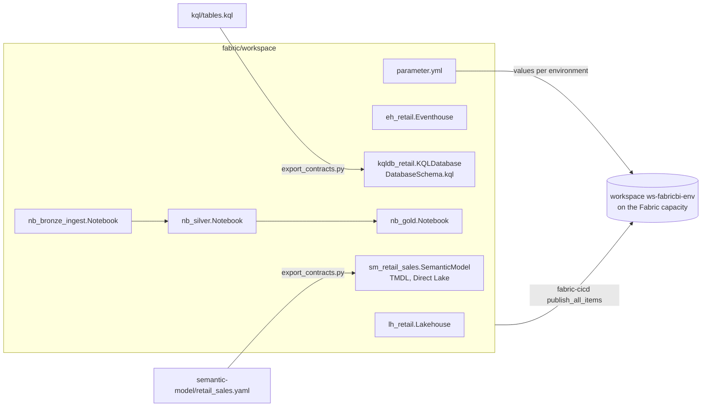

# Fabric workspace items

**Purpose.** The Fabric side of the platform (Lakehouse, Eventhouse, KQL database, notebooks,
semantic model) is defined as files in [`fabric/workspace/`](../fabric/workspace/README.md), in
the folder format that Fabric Git integration writes. The deploy workflow publishes the same
files to the dev and prod workspaces with fabric-cicd, so every change to an item is a reviewed
diff.

## Architecture



## How it works

1. Each item is a folder `<displayName>.<ItemType>` with a `.platform` file (type, display name,
   and a stable `logicalId`) and the item's own definition files.
2. Two items are generated: the KQL database schema from `kql/tables.kql`, and the semantic
   model's TMDL from `semantic-model/retail_sales.yaml`. CI fails if either is stale.
3. The three notebooks are Fabric Python notebook source files (`# Fabric notebook source`, `META`
   blocks naming the `synapse_pyspark` kernel and `lh_retail` as the default Lakehouse).
4. In the deploy workflow, `deploy.sh fabric` creates or finds `ws-fabricbi-<env>` on the
   capacity with the Fabric REST API, then
   [`scripts/publish_fabric_items.py`](../scripts/publish_fabric_items.py) runs fabric-cicd's
   `publish_all_items` and `unpublish_all_orphan_items` for the five item types.
5. `parameter.yml` swaps environment values at publish time (for example the KQL database's
   OneLake caching period: 7 days in dev, 30 in prod). Logical ids map items across
   environments, so dev and prod item ids can differ.

## Key files

| Item | Files | What it does |
|---|---|---|
| `lh_retail.Lakehouse` | `.platform`, `lakehouse.metadata.json` (`defaultSchema: dbo`, schemas enabled) | Lakehouse for bronze, silver and gold tables |
| `eh_retail.Eventhouse` | `.platform`, `EventhouseProperties.json` | Eventhouse for the hot path |
| `kqldb_retail.KQLDatabase` | `.platform`, `DatabaseProperties.json`, `DatabaseSchema.kql` (generated) | KQL database with `pos_events`, `freezer_readings`, `hot_alerts` |
| `nb_bronze_ingest.Notebook` | `notebook-content.py` | Landing files to bronze tables, every column as text, with `_row_hash`, `_source_file`, `_batch_id` |
| `nb_silver.Notebook` | `notebook-content.py` | POS dedupe, typing, quantity and foreign-key rules, quarantine table, ticket redaction |
| `nb_gold.Notebook` | `notebook-content.py` | Store and product dimensions with surrogate keys, sales fact, daily aggregate |
| `sm_retail_sales.SemanticModel` | `definition.pbism`, `definition/*.tmdl` (generated) | Direct Lake semantic model ([semantic-model.md](semantic-model.md)) |
| `parameter.yml` | | fabric-cicd find-and-replace and key-value replacements per environment |

## Code excerpts

An item's identity:

<!-- excerpt: fabric/workspace/lh_retail.Lakehouse/.platform -->
```json
  "metadata": {
    "type": "Lakehouse",
    "displayName": "lh_retail",
```

The silver notebook's quarantine split, the PySpark form of `quality.apply_rules`:

<!-- excerpt: fabric/workspace/nb_silver.Notebook/notebook-content.py -->
```python
checked.filter("_dq_rule IS NULL").drop("_dq_rule").write.mode("overwrite").format("delta").saveAsTable(
    "silver__pos_lines"
)
checked.filter("_dq_rule IS NOT NULL").write.mode("overwrite").format("delta").saveAsTable(
    "silver__pos_lines_quarantine"
)
```

The publish call:

<!-- excerpt: scripts/publish_fabric_items.py -->
```python
    publish_all_items(ws)
    unpublish_all_orphan_items(ws)
```

## Configuration and parameters

| Setting | Value |
|---|---|
| Workspace name | `ws-fabricbi-<env>` (`deploy.sh`) |
| Item types in scope | Lakehouse, Eventhouse, KQLDatabase, Notebook, SemanticModel |
| `parameter.yml` | Lakehouse name in notebooks per environment; `oneLakeCachingPeriod` dev P7D, prod P30D |
| Notebook default Lakehouse | `lh_retail` |
| Table naming | `<layer>__<table>` (for example `gold__fact_sales`), the same as the local lake |

## Run it locally

Fabric items cannot run without a workspace. Locally you can list and validate them:

```bash
python -m fabricbi.examples fabric_items
python scripts/export_contracts.py --check
pytest -q tests/test_10_repo.py -k "fabric or notebook or parameter"
```

<!-- example: fabric_items -->
```text
Eventhouse     eh_retail          logicalId 6c80b722...  files ['EventhouseProperties.json']
KQLDatabase    kqldb_retail       logicalId d54d05a0...  files ['DatabaseProperties.json', 'DatabaseSchema.kql']
Lakehouse      lh_retail          logicalId 734b1c2a...  files ['lakehouse.metadata.json']
Notebook       nb_bronze_ingest   logicalId d2a8ed4d...  files ['notebook-content.py']
Notebook       nb_gold            logicalId 78e137fe...  files ['notebook-content.py']
Notebook       nb_silver          logicalId 77841083...  files ['notebook-content.py']
SemanticModel  sm_retail_sales    logicalId 2f3eb8f3...  files ['definition.pbism', 'definition/model.tmdl', 'definition/relationships.tmdl'] +7 more
```

## Tests and eval gates

| Test (`tests/test_10_repo.py`) | Checks |
|---|---|
| `test_fabric_items_have_valid_platform_files` | 7 items, `.platform` type and display name match the folder, logical ids are valid and unique |
| `test_notebooks_are_fabric_python_notebooks` | each notebook starts with the Fabric header and compiles as Python |
| `test_parameter_file_covers_both_environments` | `parameter.yml` has dev and prod values |
| `test_generated_files_are_current` | TMDL and `DatabaseSchema.kql` match their sources |

## Guardrails, security and governance

- Items carry no credentials; the notebooks read through the default Lakehouse and run as the
  workspace identity or the scheduling user.
- Sensitivity labels and workspace roles are applied in Fabric, not in these files
  ([governance.md](governance.md)).
- `unpublish_all_orphan_items` removes items deleted from Git, so the workspace cannot drift from
  the repository.

## Observability

After publishing, notebook runs, refreshes and capacity use appear in the Fabric Monitoring hub
and the Capacity Metrics app. The deploy smoke test checks that `lh_retail`, `eh_retail`,
`nb_silver`, `nb_gold` and `sm_retail_sales` exist.

## Failure modes

| Failure | Handling |
|---|---|
| Two items share a logical id | `test_fabric_items_have_valid_platform_files` fails |
| Notebook has a syntax error | `test_notebooks_are_fabric_python_notebooks` fails |
| Item edited in the portal | The next publish overwrites it from Git; turn on Git integration in dev to commit portal edits back |
| Item missing after publish | Smoke test names it and the deploy fails |

## On real Fabric

These files are what Fabric Git integration commits and what fabric-cicd publishes, so no
translation is needed. The workspace must be on a capacity (F SKU or trial), the deploy identity
must be allowed to use Fabric APIs, and it must be a workspace admin or member.

## Limitations

- Nothing has been published; the items are checked structurally only.
- The notebooks cover the core of the pandas pipeline, not all of it: there is no product catalog
  flattening, no customer or date dimension, no freezer tables, no unit-price rule and no guest
  member in PySpark yet. The pandas code under `src/fabricbi/coldpath` is the complete, tested
  version.
- No Data Factory pipeline, Eventstream, Activator or report items; those are created by hand
  after the first deployment ([implementation-guide.md](implementation-guide.md)).
- The semantic model has no RLS roles in TMDL yet.
