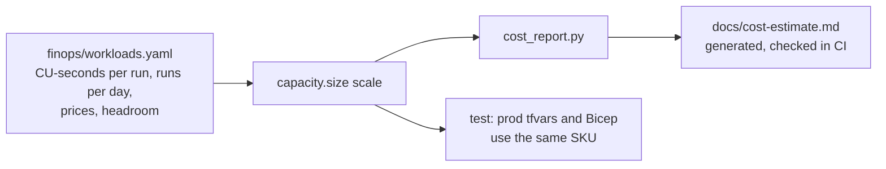

# FinOps: capacity sizing and cost estimates

**Purpose.** Before anyone buys a Fabric capacity they ask "which SKU, and what will it cost?"
This component turns written-down workload assumptions into a capacity size and monthly cost at
several load levels, keeps the production IaC on the same SKU, and lists what to measure in a
pilot. **Every number here is an estimate; nothing has run on a real capacity.**

## Architecture



## How it works

1. Each workload in [`finops/workloads.yaml`](../finops/workloads.yaml) has a kind, CU-seconds
   per run and runs per day. Daily CU-seconds = per run x runs per day x scale.
2. **Background** work (Spark, pipelines, Eventstream, training) is smoothed by Fabric over 24
   hours, so its CU is daily CU-seconds / 86,400.
3. **Interactive** work (Power BI, KQL, SQL, the data agent) is smoothed over minutes, so the
   busy period decides the size: daily CU-seconds / business-hours seconds x a peak factor of 3.
4. Required CU = background + interactive peak. The SKU is the smallest F size where required
   CU is at most 80% of the SKU (20% headroom before throttling).
5. Monthly cost = SKU x price per CU hour x 730 hours, with an illustrative reservation discount.
   A dev F2 that is paused outside 220 working hours a month is costed separately, as are Foundry
   tokens for the data agent.
6. [`scripts/cost_report.py`](../scripts/cost_report.py) writes
   [`cost-estimate.md`](cost-estimate.md); CI runs it with `--check` so the document always
   matches the assumptions.

## Key files

| File | What it does |
|---|---|
| [`finops/workloads.yaml`](../finops/workloads.yaml) | All assumptions, each with a note |
| [`src/fabricbi/finops/capacity.py`](../src/fabricbi/finops/capacity.py) | `size()`, `Sizing`, `markdown()` |
| [`scripts/cost_report.py`](../scripts/cost_report.py) | Writes or checks `docs/cost-estimate.md` |
| [`docs/cost-estimate.md`](cost-estimate.md) | Generated report, including surrounding Azure services |

## Code excerpts

The sizing rule:

<!-- excerpt: src/fabricbi/finops/capacity.py -->
```python
        if w["kind"] == "background":
            cu = daily / 86400
            bg += cu
        else:
            cu = daily / biz_seconds * a["interactive_peak_factor"]
            inter += cu
```

<!-- excerpt: src/fabricbi/finops/capacity.py -->
```python
    sku = next((s for s in spec["skus"] if required <= a["target_utilisation"] * s), spec["skus"][-1])
```

## Configuration and parameters

| Assumption | Value |
|---|---|
| Price per CU hour | $0.18 (illustrative pay-as-you-go) |
| Reservation discount | 41% (illustrative one year) |
| Hours per month / dev hours per month | 730 / 220 |
| Business hours per day | 10 |
| Interactive peak factor | 3.0 |
| Target utilisation | 0.8 |
| Foundry | 150 questions a day x 2,500 tokens at $0.60 per million |

## Run it locally

```bash
python -m fabricbi.examples finops
python scripts/cost_report.py           # rewrite docs/cost-estimate.md
python scripts/cost_report.py --check   # what CI runs
```

<!-- example: finops -->
```text
load x1: background 0.381 CU + interactive peak 1.817 CU = 2.198 CU -> F4 (55% used), pay-as-you-go $526/month, reserved $310/month
load x5: background 1.904 CU + interactive peak 9.083 CU = 10.987 CU -> F16 (69% used), pay-as-you-go $2,102/month, reserved $1,240/month
load x25: background 9.521 CU + interactive peak 45.417 CU = 54.938 CU -> F128 (43% used), pay-as-you-go $16,819/month, reserved $9,923/month
dev F2 paused outside working hours: $79/month (estimate)
```

Interactive work dominates: at the assumed load, 1.817 of the 2.198 CU is the interactive peak,
so moving report refreshes or KQL tiles off the busy hours matters more than tuning Spark.

## Tests and eval gates

[`tests/test_09_governance_ops.py`](../tests/test_09_governance_ops.py):

| Test | Checks |
|---|---|
| `test_capacity_sizing_picks_f4_with_headroom` | F4 at the assumed load, at most 80% used, reserved cheaper than pay-as-you-go |
| `test_capacity_grows_with_load` | 25x > 5x > 1x in SKU |
| `test_prod_iac_sku_matches_estimate` | `infra/terraform/envs/prod.tfvars` and `infra/main.parameters.prod.json` use the estimated SKU (F4) |
| `test_cost_report_is_labelled_as_estimate` | the report says it is an estimate |

CI also runs `cost_report.py --check`.

## Guardrails, security and governance

- Cost guardrails in the IaC: an Azure budget on the resource group with alerts at 50%, 80% and
  100% (created only when `budget_contact_emails` is set), a 1 GB daily cap on Log Analytics in
  dev, the smallest SKUs in dev, and one resource group per environment so teardown is one step.
- Pause: the deploy workflow suspends the dev capacity after its smoke tests
  (`deploy.sh suspend`); pause and resume by hand are in the
  [implementation guide](implementation-guide.md).

## Observability

On a real capacity the Fabric Capacity Metrics app shows CU use per item and operation, plus
throttling. Those readings should replace the assumptions in `workloads.yaml` after a pilot week.

## Failure modes

| Failure | Handling |
|---|---|
| Assumptions change but the report is not regenerated | `cost_report.py --check` fails in CI |
| Prod IaC drifts from the estimate | `test_prod_iac_sku_matches_estimate` fails |
| Load exceeds the largest SKU | `size()` returns the largest SKU; utilisation above 1 shows it is not enough |
| Real interactive peaks are higher than assumed | Throttling on the capacity; scale up or use surge protection, then update the YAML |

## On real Fabric

| Here | In Fabric / Azure |
|---|---|
| SKU choice | `Microsoft.Fabric/capacities` resource (`fabric_sku`) in Terraform and Bicep |
| Smoothing rule | Fabric's background (24 h) and interactive (5 to 64 minute) smoothing |
| Pay-as-you-go vs reserved | Capacity reservation purchased in the Azure portal |
| Budget | `azurerm_consumption_budget_resource_group` / `Microsoft.Consumption/budgets` |

## Limitations

- All workload numbers are assumptions; prices are illustrative and vary by region.
- Storage, networking and Purview costs are listed as rough figures in the generated report, not
  modelled.
- No autoscale or surge-protection modelling.
