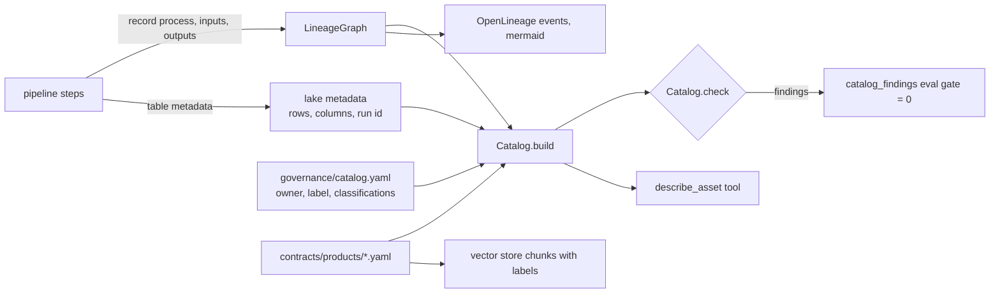

# Governance: catalog, lineage, labels, access and data products

**Purpose.** Anyone using a table should be able to find out who owns it, how sensitive it is,
where it came from, who depends on it and what the owners promise about it. Microsoft Purview is
the governance layer in the target design. Offline, the same rules are code that runs on every
pipeline execution, so they are tested rather than described.

## Architecture



## How it works

1. **Lineage is recorded, not drawn.** Every write calls `ctx.lineage.record(process, inputs,
   outputs)`, so the graph always matches the code. It answers upstream, downstream and impact
   questions and exports OpenLineage-style run events and a mermaid diagram.
2. **The catalog is built from three sources:** [`governance/catalog.yaml`](../governance/catalog.yaml)
   (owner, sensitivity label, description, column classifications, glossary, `declassify`
   reasons), the technical metadata the lake writes (row counts, column types, run id), and the
   lineage graph.
3. **`Catalog.check()` returns findings** for: an asset with no catalog entry, no owner or an
   unknown label; a classified column (email, phone, person name) on an asset labelled below
   Highly Confidential; an asset labelled below its strictest input without a `declassify`
   reason; and a data product labelled above General that is shared externally.
4. **Data products** in [`contracts/products`](../contracts/products/README.md) state owner,
   output ports, schema contracts, sensitivity, freshness and quality SLOs, consumers and sharing
   mode. `validate_product` checks completeness and consistency; `bump_for` gives the next
   semantic version from a contract change (breaking is major, additive is minor).
5. **Impact analysis** combines downstream lineage with the products' consumers: "if the POS
   export changes, which tables and which reports, agents and partners are hit?"

## Sensitivity labels and how they flow

Labels are ordered Public < General < Confidential < Highly Confidential. **An asset is at least
as restricted as its strictest input**, unless it declares why not. Four assets do:

| Asset | Own label | Declared reason |
|---|---|---|
| silver.support_tickets | General | personal data is redacted by the silver transform |
| gold.dim_date | General | only the date range is taken from sales |
| gold.fact_sales | Confidential | holds the customer surrogate key only, no contact details |
| gold.agg_daily_sales | General | aggregated to store, day and category; no customer keys |

## Data products

| Product | Version | Owner | Sensitivity | Freshness SLO | Shared externally |
|---|---|---|---|---|---|
| retail-sales | 1.2.0 | commercial-analytics | Confidential | 26 h | no |
| store-operations-live | 1.0.0 | store-operations | General | 15 min | no |
| customer-care-insights | 1.0.0 | customer-care | General | 48 h | no |
| loyalty-members | 1.0.0 | loyalty | Highly Confidential | 26 h | no |
| demand-forecast | 0.3.0 | commercial-analytics | General | 26 h | yes, to a supplier planning partner |

## Access: RLS, OLS and masking

[`governance/access-policy.yaml`](../governance/access-policy.yaml) is the single policy. The data
agent's secure session enforces it today ([data-agent.md](data-agent.md)); the same rules map onto
Power BI roles and OneLake security when deployed.

| Control | Rule |
|---|---|
| Row-level security | stores, sales, freezers and tickets filtered to the caller's regions; members by home region |
| Object-level security | `dim_product.unit_cost` and `fact_sales.cost_amount` exist only for finance |
| Masking | `dim_customer.email` and `phone` masked unless the caller has `pii_reader` |
| Cost limit | estimated rows scanned per query, per role |

## Key files

| File | What it does |
|---|---|
| [`governance/lineage.py`](../src/fabricbi/governance/lineage.py) | `LineageGraph`: record, upstream, downstream, impact, cycle check, mermaid, OpenLineage, save/load |
| [`governance/catalog.py`](../src/fabricbi/governance/catalog.py) | `Catalog.build`, `check`, `search`, `describe` |
| [`governance/labels.py`](../src/fabricbi/governance/labels.py) | Label order, `strictest`, `clearance_for(roles)` |
| [`governance/products.py`](../src/fabricbi/governance/products.py) | Load and validate products, consumers by asset, `bump_for` |
| [`governance/catalog.yaml`](../governance/catalog.yaml) | Owners, labels, classifications, glossary |
| [`governance/access-policy.yaml`](../governance/access-policy.yaml), [`principals.yaml`](../governance/principals.yaml) | Access policy and identity stand-in |
| [`contracts/products/`](../contracts/products/README.md) | Five data product contracts |

## Code excerpts

The label-flow rule:

<!-- excerpt: src/fabricbi/governance/catalog.py -->
```python
            ins = [i for i, _, o in self.lineage.edges if o == a and i in self.entries]
            need = strictest(self.label(i) for i in ins)
            if ins and rank(self.label(a)) < rank(need) and not self.entries[a].get("declassify"):
                findings.append(f"{a} is {self.label(a)} but reads {need} input without a declassify reason")
```

A data product contract:

<!-- excerpt: contracts/products/retail-sales.yaml -->
```yaml
sensitivity: Confidential
slo:
  freshness_hours: 26
  max_quarantine_rate: 0.02
consumers: [powerbi.retail-sales-report, agent.fabric-data-agent, ml.demand_forecast]
```

## Configuration and parameters

| Setting | Where |
|---|---|
| Owners, labels, classifications, `declassify` | `governance/catalog.yaml` |
| Product SLOs, consumers, sharing | `contracts/products/<name>.yaml` |
| Roles, RLS, OLS, masking, cost limits | `governance/access-policy.yaml` |
| Lineage file | `<lake>/_lineage.json`, written by every run |

## Run it locally

```bash
python -m fabricbi.examples governance
```

<!-- example: governance -->
```text
assets in lineage: 38, edges: 43, cycle: False
catalog findings: []
upstream of gold.serving_sales_daily: ['bronze.pos_lines', 'bronze.product_catalog', 'eventhouse.sales_windows', 'gold.agg_daily_sales', 'gold.dim_customer', 'gold.dim_date', 'gold.dim_product', 'gold.dim_store', 'gold.fact_sales', 'mirror.customers', 'mirror.stores', 'silver.customers', 'silver.pos_lines', 'silver.products', 'silver.stores', 'source.event_hubs.pos', 'source.opdb.customers', 'source.opdb.stores', 'source.pos_export', 'source.product_catalog']
impact of source.pos_export: 9 assets, consumers ['agent.fabric-data-agent', 'external.supplier-planning', 'ml.demand_forecast', 'powerbi.retail-sales-report']
gold.dim_customer: owner loyalty, label Highly Confidential, classified {'email': 'Email Address', 'phone': 'Phone Number', 'first_name': 'Person Name'}
product customer-care-insights   v1.0.0  General              freshness 48 h, external share False
product demand-forecast          v0.3.0  General              freshness 26 h, external share True
product loyalty-members          v1.0.0  Highly Confidential  freshness 26 h, external share False
product retail-sales             v1.2.0  Confidential         freshness 26 h, external share False
product store-operations-live    v1.0.0  General              freshness 0.25 h, external share False
```

## Tests and eval gates

[`tests/test_09_governance_ops.py`](../tests/test_09_governance_ops.py):

| Test | Checks |
|---|---|
| `test_catalog_has_no_findings` | the pipeline's own output is fully catalogued and labelled |
| `test_catalog_flags_unowned_and_downgraded_assets` | removing an owner or lowering a label without a reason is reported |
| `test_lineage_traces_sources_to_serving` | the serving view traces back to the source files and the stream |
| `test_lineage_round_trips_and_exports_openlineage` | save/load and OpenLineage events |
| `test_impact_of_a_source_change_names_consumers` | impact of the POS export includes the report, agent and partner |
| `test_label_order_and_clearance` | label order and clearance from roles |
| `test_describe_shows_classified_columns` | `describe` lists email and phone on `dim_customer` |
| `test_all_data_products_are_valid`, `test_product_validation_catches_problems` | product contracts |
| `test_restricted_products_are_not_shared_externally` | only General products are shared |
| `test_version_bump` | breaking, additive and patch bumps |

Eval gate: `catalog_findings` must be 0.

## Guardrails, security and governance

This page is the governance layer. In short: every asset has an owner and a label; personal data
is classified and can only sit in Highly Confidential assets; labels can only be lowered with a
written reason; restricted products cannot be shared outside the organisation; and retrieval,
the data agent and the MCP tools all respect the same labels and policy.

## Observability

Lineage and catalog checks run inside every pipeline run; the result is part of the eval report
(`catalog_findings`). Freshness per product is computed from table metadata
([observability.md](observability.md)).

## Failure modes

| Failure | Handling |
|---|---|
| A new table is written without a catalog entry | `uncatalogued asset` finding; eval gate fails |
| PII column added to a General table | classification finding |
| Label lowered by accident | label-flow finding unless `declassify` is set |
| Confidential product marked for external share | finding |
| Contract change that breaks consumers | `compatibility()` says breaking; `bump_for` gives a major version; impact lists who to tell |
| Lineage loop introduced | `has_cycle()` is checked by the example and the tests |

## On real Fabric

| Here | In Microsoft Purview / Fabric |
|---|---|
| `catalog.yaml` | Purview Unified Catalog: data assets with owners, glossary terms and classifications (the Fabric tenant is scanned by Purview, which the Terraform and Bicep provision when `deploy_purview` is on) |
| Labels | Microsoft Purview Information Protection sensitivity labels applied to Fabric items; labels flow downstream automatically in Fabric |
| `LineageGraph` | Fabric's built-in lineage view plus Purview lineage; OpenLineage events could be pushed through the Purview API |
| Data product contracts | Purview data products in a governance domain, with OneLake shortcuts for internal sharing and external data sharing for the partner |
| `access-policy.yaml` | Power BI RLS/OLS roles on the semantic model and OneLake security roles on the Lakehouse |

## Limitations

- Nothing is pushed to Purview; the catalog lives in YAML and is checked in CI.
- Fabric roles and OneLake security are not yet generated from `access-policy.yaml`.
- Classification is declared by hand, not detected by scanning.
