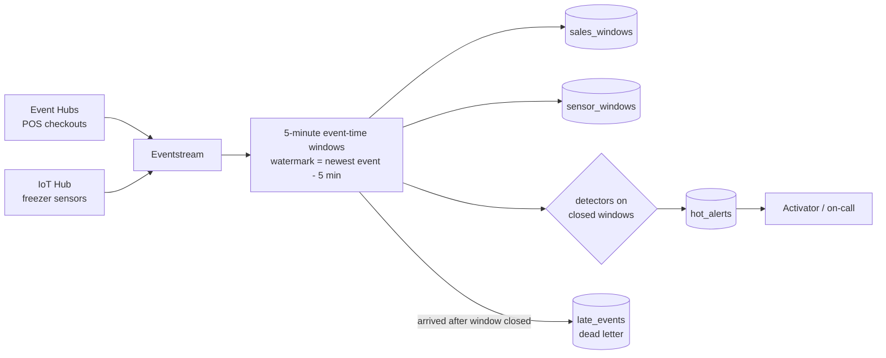
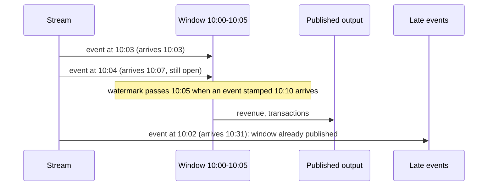

# Hot path: streaming windows and alerts

**Purpose.** The hot path answers "what is happening in the stores right now": revenue per store
every five minutes, and an alert within minutes when a freezer runs warm, a sensor goes silent or
a store sees an unusual burst of sales. It covers the trading day after the batch cut-off; the
cold path takes over the next morning ([lambda-view.md](lambda-view.md)).

## Architecture



Here the stream is simulated by [`stream.py`](../src/fabricbi/hotpath/stream.py) and processed by
[`windows.py`](../src/fabricbi/hotpath/windows.py); the [`kql/`](kql.md) files are the
Eventhouse version of the same logic.

## How it works

1. **Simulate the day.** `stream.simulate(day)` produces six hours of checkouts for 12 stores
   (Poisson arrivals) and one reading per minute from 24 freezers. Each event has an
   `event_time` and an `ingest_time`. Most arrive within 20 seconds, about 3.5% are 1 to 4
   minutes late, and 0.5% are 18 to 30 minutes late. Events are delivered in ingest order.
   Three incidents are planted: S002 has a burst of checkouts from 10:00 to 10:30, S007-FZ2 starts
   warming at 11:00, and S010-FZ1 goes silent from 12:00 to 12:40.
2. **Assign windows by event time.** Each event goes to the 5-minute window that contains its
   `event_time`, not its arrival time.
3. **Advance the watermark.** The watermark is the newest event time seen minus five minutes. A
   window is closed and published once the watermark passes its end.
4. **Send late events to a dead letter.** An event whose window is already published is appended
   to `late_events` instead of changing a number someone has already seen. The cold path picks
   those sales up from the next batch file, so nothing is lost.
5. **Run the detectors on each closed window** (table below). Each incident raises one alert and
   stays quiet until it clears, so a warm freezer does not page someone every five minutes.
6. **Write the outputs.** `run_hot_path()` in [`pipeline.py`](../src/fabricbi/pipeline.py) writes
   `sales_windows`, `sensor_windows` and `hot_alerts` as Parquet under `eh_retail/` (the
   Eventhouse stand-in) and records lineage from `source.event_hubs.pos` and
   `source.iot_hub.freezers`.



## Detectors

| Alert | Rule | Severity | Constants |
|---|---|---|---|
| `freezer_warm` | a freezer's 5-minute average is above -12 C for three windows in a row | critical | `WARM_THRESHOLD_C`, `WARM_WINDOWS` |
| `sensor_offline` | a device has sent nothing for more than 15 minutes | warning | `OFFLINE_AFTER` |
| `sales_spike` | window revenue at least 3 standard deviations above the store's previous 12 windows, and at least 300 | info | `SPIKE_Z`, `BASELINE_WINDOWS`, `MIN_SPIKE_REVENUE` |

A spike clears when the z-score falls below half the threshold; a warm alert clears after one
window back under -12 C; an offline alert clears on the next reading.

## Key files

| File | What it does |
|---|---|
| [`hotpath/stream.py`](../src/fabricbi/hotpath/stream.py) | Seeded event simulator with the three planted incidents and realistic lateness |
| [`hotpath/windows.py`](../src/fabricbi/hotpath/windows.py) | `HotPathProcessor`: windows, watermark, late events, detectors, alert de-duplication |
| [`pipeline.py`](../src/fabricbi/pipeline.py) | `run_hot_path()`: runs the processor, writes the Eventhouse tables, records lineage and the late-event counter |
| [`kql/*.kql`](kql.md) | The Eventhouse queries with the same constants |

## Code excerpts

The constants, which the KQL files must match:

<!-- excerpt: src/fabricbi/hotpath/windows.py -->
```python
WINDOW_SIZE = timedelta(minutes=5)
ALLOWED_LATENESS = timedelta(minutes=5)
WARM_THRESHOLD_C = -12.0
WARM_WINDOWS = 3
OFFLINE_AFTER = timedelta(minutes=15)
SPIKE_Z = 3.0
BASELINE_WINDOWS = 12
MIN_SPIKE_REVENUE = 300.0
```

Late events and the watermark:

<!-- excerpt: src/fabricbi/hotpath/windows.py -->
```python
        ws = window_start(e.event_time)
        if self.closed_until is not None and ws < self.closed_until:
            self.result.late_events.append(e)
            return
```

<!-- excerpt: src/fabricbi/hotpath/windows.py -->
```python
        wm = e.event_time - ALLOWED_LATENESS
        if self.watermark is None or wm > self.watermark:
            self.watermark = wm
            self._close(until=self.watermark)
```

One alert per incident:

<!-- excerpt: src/fabricbi/hotpath/windows.py -->
```python
    def _raise(self, kind: str, key: str, ws: datetime, detail: str, severity: str = "warning") -> None:
        if (kind, key) not in self.active:
            self.active.add((kind, key))
            self.result.alerts.append(Alert(kind, key, ws, detail, severity))
```

## Configuration and parameters

| Parameter | Value | Where |
|---|---|---|
| Window size | 5 minutes | `WINDOW_SIZE`, `let window_size = 5m;` |
| Allowed lateness | 5 minutes | `ALLOWED_LATENESS`, `let allowed_lateness = 5m;` |
| Warm threshold / run length | -12.0 C / 3 windows | `WARM_THRESHOLD_C`, `WARM_WINDOWS` (gold's freezer summary uses the same threshold) |
| Offline after | 15 minutes | `OFFLINE_AFTER` |
| Spike | z >= 3.0 over 12 windows, revenue >= 300 | `SPIKE_Z`, `BASELINE_WINDOWS`, `MIN_SPIKE_REVENUE` |
| Simulated day | 6 hours from 08:00, seed 11 | `stream.simulate(day, hours=6, seed=11, open_hour=8)` |
| KQL lookback | 6 hours | `ago(6h)` in each query |

## Run it locally

```bash
python -m fabricbi.examples hotpath
```

<!-- example: hotpath -->
```text
events accepted into windows: 10,146
late events (after their window was published): 48
sales windows: 863, sensor windows: 1,720
constants: window 0:05:00, lateness 0:05:00, warm > -12.0 C for 3 windows, offline after 0:15:00, spike z >= 3.0 and >= 300.0
alert sales_spike     S002      10:00 info     revenue 455 vs baseline 45 (z=9.3)
alert freezer_warm    S007-FZ2  11:35 critical avg -8.8 C above -12.0 C for 3 windows
alert sensor_offline  S010-FZ1  12:10 warning  no readings since 11:59
```

The 48 late events are the ones that arrived after their window was published; they are counted,
not merged.

## Tests and eval gates

[`tests/test_05_hotpath.py`](../tests/test_05_hotpath.py):

| Test | Checks |
|---|---|
| `test_three_planted_incidents_are_alerted` | the alerts are exactly the three planted incidents |
| `test_late_events_are_counted_not_merged` | exactly 48 events are dead-lettered and the rest are accepted |
| `test_stream_is_delivered_in_ingest_order` | the simulator delivers events in arrival order and some are later than the allowed lateness |
| `test_window_start_aligns_to_five_minutes` | window boundaries |
| `test_sales_windows_are_complete_per_store` | all 12 stores appear and every window starts on a 5-minute boundary |
| `test_single_warm_window_does_not_alert` | one warm window is not enough |
| `test_quiet_stream_has_no_spike` | no spike alert once the planted burst store is removed |
| `test_kql_constants_match_python` | the `let` constants in each `.kql` file equal the Python constants (8 cases) |
| `test_every_kql_file_reads_a_declared_table` | each query reads a table created in `tables.kql` |

Eval gates in [`evals/thresholds.yaml`](../evals/thresholds.yaml): `hotpath_alert_precision` and
`hotpath_alert_recall` must both be 1.0 against the three planted incidents.

## Guardrails, security and governance

- Stream payloads carry no personal data: store, transaction id, basket value, item count,
  device id and temperature only.
- The live product `store-operations-live` is labelled General and has a 15-minute freshness SLO
  (0.25 hours) in its contract ([governance.md](governance.md)).
- Lineage edges from the two stream sources to the Eventhouse tables appear in the catalog, so
  impact analysis covers the hot path too.

## Observability

The run is wrapped in a `hotpath.eventstream` span (attribute `messaging.system=eventhubs`) and
adds the `fabricbi.hotpath.late_events` counter. A rising late-event count is the first sign of a
backed-up producer or a clock problem. [`kql/late_events.kql`](../kql/late_events.kql) is the
Eventhouse equivalent, per hour.

## Failure modes

| Failure | Handling |
|---|---|
| Events arrive out of order | Windows use event time; the watermark waits five minutes |
| Events arrive very late | Dead-lettered and counted; the cold path includes them the next day |
| A freezer blips warm once | No alert until three windows in a row |
| An incident lasts an hour | One alert, not twelve; it re-arms only after it clears |
| A sensor stops sending | `sensor_offline` after 15 minutes of silence |
| A threshold is changed in Python but not in KQL | `test_kql_constants_match_python` fails in CI |
| Quiet store with tiny revenue gets a high z-score | `MIN_SPIKE_REVENUE` of 300 suppresses it |

## On real Fabric

| Here | In Fabric / Azure |
|---|---|
| `stream.simulate` | Event Hubs namespace `evh-...` (POS) and IoT Hub (freezers), provisioned in [infrastructure.md](infrastructure.md) |
| `HotPathProcessor` | Eventstream with an Eventhouse destination; windows computed by the KQL update policies or queries in [`kql/`](kql.md) |
| `eh_retail/*.parquet` | `eh_retail` Eventhouse, `kqldb_retail` KQL database, tables from `tables.kql` |
| `late_events` list | Eventstream late-arrival handling plus `late_events.kql` |
| `hot_alerts` | Fabric Activator rules on the alert query, routed to Teams or email |

## Limitations

- The stream is simulated in process; nothing here connects to Event Hubs or IoT Hub.
- The KQL has not been run against an Eventhouse. Its constants are checked against Python, but
  its results are not compared with the Python output.
- Detectors are rule based; there is no seasonal baseline (time of day, day of week) for spikes.
- State lives in memory, so a restart would lose open windows; Eventstream manages this in Fabric.
