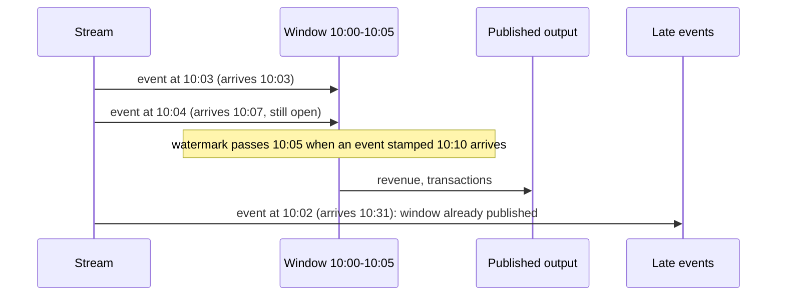

# Hot path: streaming windows and alerts

Live checkouts (Event Hubs) and freezer readings (IoT Hub) arrive in a Fabric Eventstream and
land in an Eventhouse. The Python in [`hotpath/`](../src/fabricbi/hotpath) does the same work on a
simulated day so it can be tested; the [`kql/`](../kql) files are the Eventhouse version.

## Event time, watermark and late events

Windows are five minutes long and keyed by **event time** (when the checkout happened), not
arrival time. Arrival order is messy on purpose: most events show up within seconds, about one in
thirty is a few minutes late, and about one in two hundred is twenty minutes or more late.

- The watermark trails the newest event time seen by five minutes (`ALLOWED_LATENESS`).
- A window is published when the watermark passes its end.
- An event that turns up after its window was published goes to the `late_events` list (the
  dead-letter output) instead of quietly changing a number someone has already seen. The cold
  path picks those sales up the next day, so nothing is lost; it is only late.

## Detectors

| Alert | Rule | Severity | Constant(s) |
|---|---|---|---|
| `freezer_warm` | a freezer's 5-minute average is above -12 C for three windows in a row | critical | `WARM_THRESHOLD_C`, `WARM_WINDOWS` |
| `sensor_offline` | a device has sent nothing for more than 15 minutes | warning | `OFFLINE_AFTER` |
| `sales_spike` | window revenue at least 3 standard deviations above the store's previous 12 windows, and at least 300 | info | `SPIKE_Z`, `BASELINE_WINDOWS`, `MIN_SPIKE_REVENUE` |

Each incident raises one alert and stays quiet until it clears, so a warm freezer does not page
someone every five minutes. The simulated day has exactly three planted incidents and the eval
gate requires precision and recall of 1.0 on them.

## KQL and Python stay in step

Each `.kql` file declares its constants with `let` statements (`let warm_threshold_c = -12.0;`).
`tests/test_kql_parity.py` parses those and compares them with the Python constants, so changing a
threshold in one place and not the other fails CI. The KQL is written for an Eventhouse but is not
executed offline; the Python twin is what the tests run.

| File | What it computes |
|---|---|
| [`tables.kql`](../kql/tables.kql) | tables, retention and the JSON ingestion mapping |
| [`sales_5min.kql`](../kql/sales_5min.kql) | revenue and transactions per store per window |
| [`freezer_alerts.kql`](../kql/freezer_alerts.kql) | consecutive warm windows per freezer |
| [`sensor_offline.kql`](../kql/sensor_offline.kql) | gaps longer than the offline limit |
| [`sales_spike.kql`](../kql/sales_spike.kql) | z-score against a trailing 12-window baseline |
| [`late_events.kql`](../kql/late_events.kql) | arrivals after their window closed, per hour |
