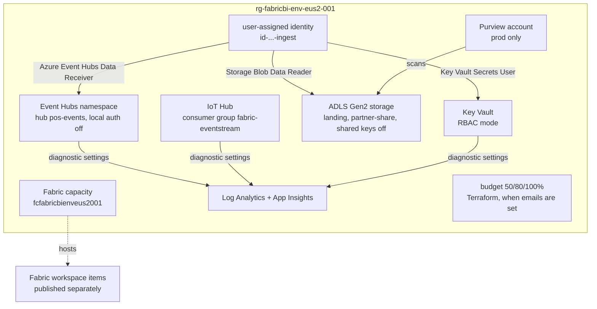

# Infrastructure: Bicep and Terraform

**Purpose.** The Azure resources around Fabric (the capacity, streaming ingress, landing storage,
secrets, monitoring and Purview) are code, written twice: Bicep in [`infra/`](../infra/README.md)
and Terraform in [`infra/terraform/`](../infra/terraform/README.md). Both create the same
resources with the same names, tags and outputs, so a client can use whichever tool their
platform team runs ([ADR 0001](adr/0001-bicep-and-terraform.md)). Dev uses the smallest
SKUs; prod is hardened and sized from the cost estimate.

## Architecture



## How it works

1. A **naming module** builds CAF names from workload, environment, region and instance
   (`rg-fabricbi-dev-eus2-001`). Resources that need globally unique, alphanumeric names
   (storage, Fabric capacity) drop the dashes. An optional `name_suffix` is appended to globally
   unique names so a fork can deploy next to the original without collisions.
2. **Tags**: six required tags on everything: `env`, `owner`, `project`, `cost-center`,
   `workload`, `managed-by`.
3. **One ingestion identity** gets data-plane roles only: receive from Event Hubs, read the
   landing storage, read Key Vault secrets. No keys or connection strings are created.
4. **Keyless by default**: Event Hubs `local_authentication_enabled = false`, storage
   `shared_access_key_enabled = false`, Key Vault in RBAC mode, TLS 1.2 minimum.
5. **Streaming**: Event Hubs Basic in dev has only the `$Default` consumer group, so the
   `fabric-eventstream` consumer group is created on Standard and above; IoT Hub always gets one.
6. **Fabric capacity** (`azurerm_fabric_capacity` / `Microsoft.Fabric/capacities`) with
   administrators from `fabric_admins`. Set `deploy_fabric_capacity = false` to use a trial
   capacity instead.
7. **Purview** is created only when `deploy_purview` is true (prod), with the landing storage as a
   scan scope.
8. **Budget** (Terraform): a monthly budget on the resource group with alerts at 50% and 80%
   actual and 100% forecasted, created only when `budget_contact_emails` is not empty.
9. **State** (Terraform): a partial `azurerm` backend; the deploy script passes the state
   resource group and storage account, and the provider uses Entra ID for state access.

## Environment profiles

| Setting | dev | prod |
|---|---|---|
| Fabric SKU | F2 | F4 (from the [cost estimate](cost-estimate.md)) |
| Event Hubs | Basic, 1 TU | Standard, 2 TU, Eventstream consumer group |
| IoT Hub | F1 (free, one per subscription) | S1 |
| Storage replication | LRS | ZRS |
| Purview | off | on |
| Log Analytics | 1 GB a day cap, 30 days | no cap, 90 days |
| Key Vault purge protection | off (clean teardown) | on |
| Budget | $50, only if emails are set | $2,000, only if emails are set |

## Key files

| File | What it does |
|---|---|
| [`infra/main.bicep`](../infra/main.bicep) | Resource-group-scope Bicep: identity and six modules |
| [`infra/main.parameters.dev.json`](../infra/main.parameters.dev.json), [`main.parameters.prod.json`](../infra/main.parameters.prod.json) | Bicep parameters per environment |
| [`infra/modules/*.bicep`](../infra/modules/README.md) | fabric, keyvault, monitoring, purview, storage, streaming |
| [`infra/terraform/main.tf`](../infra/terraform/main.tf) | Resource group, identity, modules, Key Vault diagnostics, budget |
| [`infra/terraform/variables.tf`](../infra/terraform/variables.tf) | Inputs with validation (SKUs, admins, emails) |
| [`infra/terraform/envs/`](../infra/terraform/envs/README.md) | `dev.tfvars`, `prod.tfvars` and backend keys |
| [`infra/terraform/modules/`](../infra/terraform/modules/README.md) | naming, fabric-capacity, keyvault, monitoring, purview, storage, streaming |
| [`infra/terraform/tests/plan.tftest.hcl`](../infra/terraform/tests/plan.tftest.hcl) | Offline plan tests with mocked providers |
| [`.checkov.yaml`](../.checkov.yaml), [`infra/terraform/.tflint.hcl`](../infra/terraform/.tflint.hcl) | Security scan and lint configuration |

## Code excerpts

The Fabric capacity:

<!-- excerpt: infra/terraform/modules/fabric-capacity/main.tf -->
```hcl
resource "azurerm_fabric_capacity" "this" {
  name                   = var.name
  resource_group_name    = var.resource_group_name
  location               = var.location
  tags                   = var.tags
  administration_members = var.admin_members
```

Keyless Event Hubs and the tier-dependent consumer group:

<!-- excerpt: infra/terraform/modules/streaming/main.tf -->
```hcl
  local_authentication_enabled  = false
  minimum_tls_version           = "1.2"
```

<!-- excerpt: infra/terraform/modules/streaming/main.tf -->
```hcl
resource "azurerm_eventhub_consumer_group" "eventstream" {
  for_each            = var.eventhubs_sku == "Basic" ? toset([]) : toset(var.hubs)
```

A plan test:

<!-- excerpt: infra/terraform/tests/plan.tftest.hcl -->
```hcl
    condition     = module.fabric[0].sku == "F2" && local.fabric_name == "fcfabricbideveus2001"
    error_message = "dev uses the smallest Fabric SKU with a lowercase alphanumeric name"
```

## Configuration and parameters

| Terraform variable | Bicep parameter | Meaning |
|---|---|---|
| `environment`, `location`, `instance` | `environmentName`, `location`, `regionShort`, `instance` | Name parts |
| `deploy_fabric_capacity`, `fabric_sku`, `fabric_admins` | `deployFabricCapacity`, `fabricSku`, `fabricAdmins` | Capacity |
| `eventhubs_sku`, `eventhubs_capacity`, `iothub_sku` | `eventHubsSku`, `iotHubSku` | Streaming |
| `storage_replication` | `storageSku` | Landing storage |
| `deploy_purview` | `deployPurview` | Purview |
| `log_daily_quota_gb`, `log_retention_days` | `logDailyQuotaGb` | Monitoring |
| `purge_protection`, `public_network_access` | `purgeProtection` | Hardening |
| `private_networking` (default `false`; `true` in `prod.tfvars`) | `privateNetworking` (default `false`) | Private endpoints for Key Vault and Purview |
| `monthly_budget`, `budget_contact_emails` | none | Budget (Terraform only) |

Outputs (same names in both): `AZURE_RESOURCE_GROUP`, `fabricCapacityName`,
`eventHubsNamespace`, `iotHubName`, `storageAccount`, `keyVaultName`, `logAnalyticsName`,
`purviewAccount`, `ingestIdentityClientId`.

## Run it locally

No Azure account is needed for any of these:

```bash
export PATH=~/bin:$PATH        # where terraform, bicep and tflint are installed on this box
make terraform                 # fmt -check, init -backend=false, validate, terraform test
make bicep                     # bicep build infra/main.bicep
checkov -d infra/terraform --config-file .checkov.yaml
(cd infra/terraform && tflint --init && tflint --call-module-type=all --format compact)
```

Real output (Terraform 1.16.4, Bicep CLI 0.47.16):

```text
$ terraform validate
Success! The configuration is valid.

$ terraform test
tests/plan.tftest.hcl... in progress
  run "dev_smallest_skus"... pass
  run "trial_capacity_instead_of_f_sku"... pass
  run "prod_hardened"... pass
tests/plan.tftest.hcl... tearing down
tests/plan.tftest.hcl... pass

Success! 3 passed, 0 failed.

$ checkov -d infra/terraform --config-file .checkov.yaml
terraform scan results:

Passed checks: 16, Failed checks: 0, Skipped checks: 0

$ tflint --call-module-type=all --format compact
(no findings)

$ bicep build infra/main.bicep --stdout > /dev/null
(no warnings)
```

## Tests and eval gates

| Check | Where | Covers |
|---|---|---|
| `terraform test` (3 runs) | `infra.yml`, `make terraform` | dev names, tags and smallest SKUs; trial capacity creates no F SKU; prod adds Purview, a budget with 3 notifications and F4 |
| `terraform fmt`, `validate` | `infra.yml` | syntax and types |
| tflint | `infra.yml` | azurerm rules |
| checkov | `infra.yml` | security policies; skips are listed with a reason in `.checkov.yaml` |
| `bicep build` | `ci.yml` | Bicep compiles |
| `test_prod_iac_sku_matches_estimate` | `tests/test_09_governance_ops.py` | prod tfvars and Bicep parameters use the estimated SKU |

## Guardrails, security and governance

- No keys: SAS and shared keys are off; data access uses Entra ID roles on one identity.
- Least privilege: the identity only receives, reads and reads secrets.
- Checkov skips are deliberate and documented: dev keeps public endpoints (with keyless auth),
  purge protection and replication are variables, and customer-managed keys are not used. The
  prod answer for each is noted in the config.
- Required tags support cost reporting and ownership.

## Observability

Key Vault, Event Hubs and IoT Hub send logs and metrics to Log Analytics through diagnostic
settings. Application Insights is workspace-based and is where the OpenTelemetry records would go
([observability.md](observability.md)).

## Failure modes

| Failure | Handling |
|---|---|
| F1 IoT Hub already used in the subscription | Apply fails; set `iothub_sku = "B1"` (noted in the parameter description) |
| Event Hubs Basic with a consumer group | Not created on Basic, so apply does not fail |
| Invalid SKU, admin or email | Variable validation fails the plan |
| Purge protection on in dev | Teardown would leave the vault soft-deleted; it is off in dev |
| Name collision on global names | Set `name_suffix` (for example your initials) and apply again |

## On real Fabric

These are the real resource types. `azurerm_fabric_capacity` and
`Microsoft.Fabric/capacities` create a billable capacity; the workspace and items are published
afterwards with the Fabric REST API and fabric-cicd ([fabric-items.md](fabric-items.md)).

## Limitations

- Never applied to a subscription; only validated, tested with mocked providers and scanned.
- Private networking is optional and covers Key Vault and Purview only. With
  `private_networking = true` (Bicep `privateNetworking`) both tools add a VNet, a
  private-endpoint subnet behind an NSG, private DNS zones (`privatelink.vaultcore.azure.net`,
  `privatelink.purview.azure.com`, `privatelink.purviewstudio.azure.com`) and private endpoints for
  the vault and the Purview account and portal, and turn public network access off on both.
  Public stays the default; `prod.tfvars` turns it on. Built and plan-tested offline, never deployed.
- Not covered by that option: Purview ingestion private endpoints and the managed VNet
  integration runtime, Event Hubs, IoT Hub and the landing storage account, and managed private
  endpoints from Fabric. Those keep public network access with Entra-only auth.
- Bicep has no budget resource; the budget exists only in Terraform.
- No Foundry project, alert rules or action groups in the IaC yet.
- Fabric tenant settings, workspace roles and OneLake security are not IaC.
