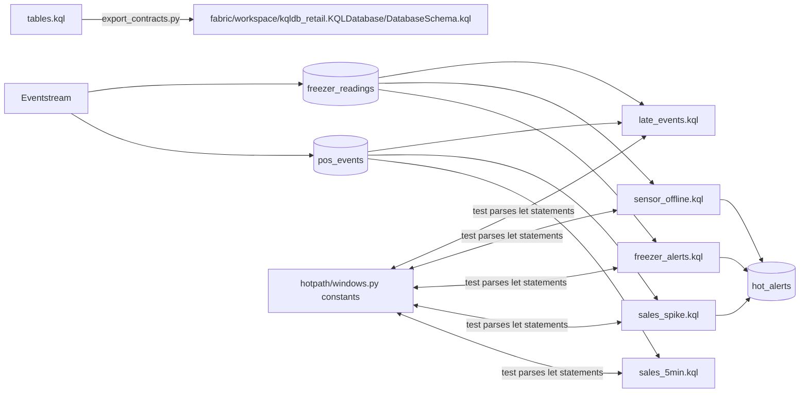

# KQL: Eventhouse queries and Log Analytics monitoring

**Purpose.** The hot path in Fabric runs in an Eventhouse, whose language is KQL. The
[`kql/`](../kql/README.md) folder holds the Eventhouse tables and the five hot-path queries, and
[`kql/monitoring/`](../kql/monitoring/README.md) holds three Log Analytics queries for alerts.
Each Eventhouse query has a Python twin that the tests run, and a test keeps their constants equal.

## Architecture



## How it works

1. [`tables.kql`](../kql/tables.kql) creates `pos_events`, `freezer_readings` and `hot_alerts`,
   sets a 7-day retention on the raw tables (the Lakehouse keeps history) and defines the JSON
   ingestion mapping `freezer_json` for the Eventstream destination.
2. `scripts/export_contracts.py` copies it into the KQL database item's `DatabaseSchema.kql`, so
   publishing the item creates the tables. CI checks the copy is current.
3. Each query declares its thresholds as `let` statements at the top and looks back six hours.
4. `freezer_alerts.kql` averages each freezer per 5-minute window, finds runs of consecutive warm
   windows with `row_cumsum`, and keeps runs of three or more.
5. `sales_spike.kql` builds a 5-minute revenue series per store with `make-series`, computes a
   trailing 12-window mean and standard deviation with `series_fir`, and keeps windows with
   z of at least 3 and revenue of at least 300.
6. `sensor_offline.kql` finds gaps longer than 15 minutes between consecutive readings of a
   device.
7. `late_events.kql` compares `ingestion_time()` with each event's window end plus the allowed
   lateness and counts late events per source and hour.
8. The monitoring queries read Application Insights tables (`AppDependencies`, `AppMetrics`) and
   a planned publish log (`FabricBiPublish_CL`).

## Key files

| File | What it computes | Python twin |
|---|---|---|
| [`tables.kql`](../kql/tables.kql) | tables, retention, JSON mapping | `pipeline.run_hot_path` outputs |
| [`sales_5min.kql`](../kql/sales_5min.kql) | revenue and transactions per store per window | `HotPathResult.sales_windows` |
| [`freezer_alerts.kql`](../kql/freezer_alerts.kql) | consecutive warm windows per freezer | `freezer_warm` detector |
| [`sensor_offline.kql`](../kql/sensor_offline.kql) | gaps longer than the offline limit | `sensor_offline` detector |
| [`sales_spike.kql`](../kql/sales_spike.kql) | z-score against a trailing 12-window baseline | `sales_spike` detector |
| [`late_events.kql`](../kql/late_events.kql) | arrivals after their window closed, per hour | `HotPathResult.late_events` |
| [`monitoring/freshness_slo.kql`](../kql/monitoring/freshness_slo.kql) | freshness status per data product | `observability/slo.py` |
| [`monitoring/pipeline_failures.kql`](../kql/monitoring/pipeline_failures.kql) | failed steps in the last day, with the exception type | span status in `telemetry.py` |
| [`monitoring/agent_queries.kql`](../kql/monitoring/agent_queries.kql) | data agent outcomes per day | `fabricbi.agent.queries` |

## Code excerpts

The warm-run logic:

<!-- excerpt: kql/freezer_alerts.kql -->
```kusto
| extend warm = avg_temp_c > warm_threshold_c
| extend run_id = row_cumsum(iff(warm and prev(warm) and device_id == prev(device_id), 0, 1))
| where warm
| summarize first_window = min(window_start), windows = count(), peak_c = max(max_temp_c) by device_id, run_id
| where windows >= warm_windows
```

The trailing baseline for spikes:

<!-- excerpt: kql/sales_spike.kql -->
```kusto
| extend mean_incl = series_fir(revenue, repeat(1, baseline_windows), true, false),
         sq_incl = series_fir(sq, repeat(1, baseline_windows), true, false)
```

## Configuration and parameters

| Constant | Files | Value |
|---|---|---|
| `window_size` | sales_5min, freezer_alerts, sales_spike, late_events | 5m |
| `warm_threshold_c`, `warm_windows` | freezer_alerts | -12.0, 3 |
| `offline_after` | sensor_offline | 15m |
| `spike_z`, `baseline_windows`, `min_spike_revenue` | sales_spike | 3.0, 12, 300.0 |
| `allowed_lateness` | late_events | 5m |
| Lookback | every hot-path query | 6h |
| Raw retention | tables.kql | 7 days |
| OneLake caching period | `parameter.yml` for the KQL database | dev P7D, prod P30D |

## Run it locally

KQL needs an Eventhouse to execute, so locally the files are parsed, not run. The example reads
each file's `let` constants and compares them with the Python twin:

```bash
python -m fabricbi.examples kql
pytest -q tests/test_05_hotpath.py -k kql
```

<!-- example: kql -->
```text
freezer_alerts.kql   window_size=5m (matches Python), warm_threshold_c=-12.0 (matches Python), warm_windows=3 (matches Python)
late_events.kql      allowed_lateness=5m (matches Python), window_size=5m (matches Python)
sales_5min.kql       window_size=5m (matches Python), lookback=6h
sales_spike.kql      window_size=5m (matches Python), spike_z=3.0 (matches Python), baseline_windows=12 (matches Python), min_spike_revenue=300.0 (matches Python)
sensor_offline.kql   offline_after=15m (matches Python)
tables.kql           table definitions
```

## Tests and eval gates

| Test | Checks |
|---|---|
| `tests/test_05_hotpath.py::test_kql_constants_match_python` (8 cases) | every `let` constant above equals the Python constant |
| `tests/test_05_hotpath.py::test_every_kql_file_reads_a_declared_table` | each query reads a table created in `tables.kql` |
| `tests/test_10_repo.py::test_generated_files_are_current` | `DatabaseSchema.kql` matches `tables.kql` |

The hot-path eval gates (alert precision and recall 1.0) run on the Python twin.

## Guardrails, security and governance

The raw tables hold no personal data and keep it for 7 days only. Access to the KQL database
follows workspace roles; the alert table is read by Activator and on-call staff.

## Observability

`late_events.kql` is itself an operational signal for the stream. The monitoring queries are the
alert definitions for the batch pipeline and the data agent ([observability.md](observability.md)).

## Failure modes

| Failure | Handling |
|---|---|
| A threshold changes in one language only | `test_kql_constants_match_python` fails |
| A query reads a table that does not exist | `test_every_kql_file_reads_a_declared_table` fails |
| Schema edited in the item folder instead of `tables.kql` | `export_contracts.py --check` fails in CI |
| Eventstream payload field renamed | Ingestion mapping no longer matches; rows land with empty columns (watch row counts) |

## On real Fabric

Publishing `kqldb_retail` with fabric-cicd runs `DatabaseSchema.kql` in the KQL database inside
the `eh_retail` Eventhouse. The Eventstream's Eventhouse destination uses the `freezer_json`
mapping. The alert queries become Activator rules or KQL queryset tiles on a real-time dashboard;
the monitoring queries become Azure Monitor scheduled query alerts on the Log Analytics workspace.

## Limitations

- None of the KQL has been executed. Only constants and table references are checked; results
  are not compared with the Python output.
- `pos_events` has no JSON mapping yet (only `freezer_readings` does).
- The hot-path queries are queries, not update policies or materialized views; for production
  the 5-minute aggregate would be a materialized view.
