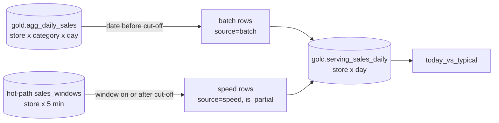

# Lambda serving view: batch history plus today

**Purpose.** A store manager wants one table that shows the last eight weeks *and* today so far.
The cold path is complete and corrected but runs once a day; the hot path is immediate but only
covers the hours since the last batch. The serving view stitches the two at the batch cut-off so
no day is missing and no day is counted twice.

## Architecture



## How it works

1. Roll gold's daily aggregate up from store and category to store and day, mapping the
   surrogate `store_key` back to `store_id`.
2. Keep only batch days **before** the cut-off and tag them `source=batch`, `is_partial=False`.
3. Keep only hot-path windows **on or after** the cut-off, sum them per store and day, and tag
   them `source=speed`, `is_partial=True`. Any speed row from before the cut-off is dropped,
   because the batch already has that day.
4. Concatenate, round, sort and write `gold.serving_sales_daily` through its contract, with
   lineage from `gold.agg_daily_sales`, `gold.dim_store` and `eventhouse.sales_windows`.
5. When the next batch lands, the cut-off moves forward one day and batch numbers replace that
   day's speed numbers.
6. `today_vs_typical(view, store_id)` compares today's partial number with the store's average
   for the same weekday in the batch history.

## Key files

| File | What it does |
|---|---|
| [`src/fabricbi/lambda_view.py`](../src/fabricbi/lambda_view.py) | `serving_view()` and `today_vs_typical()` |
| [`src/fabricbi/pipeline.py`](../src/fabricbi/pipeline.py) | Calls `serving_view()` after the hot path and writes the gold table |
| [`contracts/schemas/gold.serving_sales_daily.yaml`](../contracts/schemas/gold.serving_sales_daily.yaml) | Columns, key (`store_id`, `date`) and allowed `source` values |

## Code excerpts

The cut-off rule, on both sides:

<!-- excerpt: src/fabricbi/lambda_view.py -->
```python
    batch = batch[batch.date < pd.Timestamp(cutoff)].assign(source="batch", is_partial=False)
```

<!-- excerpt: src/fabricbi/lambda_view.py -->
```python
        hot = hot[hot.window_start >= pd.Timestamp(cutoff)]
        speed = (
            hot.assign(date=hot.window_start.dt.normalize())
            .groupby(["store_id", "date"], as_index=False)
            .agg(net_sales=("revenue", "sum"), transactions=("transactions", "sum"))
            .assign(source="speed", is_partial=True)
        )
```

## Configuration and parameters

| Parameter | Value |
|---|---|
| `cutoff` | `sources.batch_cutoff`: midnight after the last batch day (day 57 of the synthetic calendar) |
| Grain | one row per store per day |
| Output columns | `store_id`, `date`, `net_sales`, `transactions`, `source`, `is_partial` |

## Run it locally

```bash
python -m fabricbi.examples lambda_view
```

<!-- example: lambda_view -->
```text
batch cut-off: day 57 of the synthetic calendar
rows: 672 batch + 12 speed
store S002, last three days:
  date  net_sales  transactions source  is_partial
day 55    1113.50            95  batch       False
day 56    1121.80           112  batch       False
day 57    5138.81           198  speed        True
{'store_id': 'S002', 'today_so_far': 5138.81, 'typical_full_day': 625.39, 'batch_days': 56}
```

672 batch rows are 12 stores times 56 days; 12 speed rows are one partial day per store. Day 57
for S002 is the day with the planted checkout burst, which is why it is far above its typical
weekday.

## Tests and eval gates

[`tests/test_06_lambda_forecast_tickets.py`](../tests/test_06_lambda_forecast_tickets.py):

| Test | Checks |
|---|---|
| `test_serving_view_never_double_counts` | one row per store and day; batch rows are before the cut-off, speed rows on or after it and marked partial |
| `test_speed_rows_before_cutoff_are_dropped` | a fake speed window from yesterday is ignored and batch totals are unchanged |
| `test_today_vs_typical_for_spike_store` | S002 has today and typical numbers from more than 30 batch days; an unknown store returns `None` |

The table is also covered by the contract check that every gold write passes.

## Guardrails, security and governance

The view holds store-level sales only, no customer data, and is catalogued as General, owned by
`commercial-analytics`. Its lineage links it to both the batch and the stream sources.

## Observability

It is written inside the pipeline run, so it shows in the `fabricbi.rows.written` counter
(`table=gold.serving_sales_daily`) and in the freshness check of the gold layer.

## Failure modes

| Failure | Handling |
|---|---|
| Hot path has no windows yet (early morning) | Speed side is empty; the view is batch only |
| Stream replays windows from before the cut-off | Dropped by the `>= cutoff` filter |
| Batch for today lands | Cut-off moves; batch replaces speed for that day |
| A store has no batch history for that weekday | `typical_full_day` is `None` instead of a misleading zero |

## On real Fabric

The batch side is a view or table over the `lh_retail` Lakehouse gold tables; the speed side is a
KQL query over the `kqldb_retail` database (available in OneLake through the Eventhouse's OneLake
availability). In Power BI the same split can be a composite model with an Import or Direct Lake
partition for history and a DirectQuery partition for today.

## Limitations

- Late events from today are only in the speed numbers if they arrived inside the allowed
  lateness; the rest appear when the batch lands.
- The view is rebuilt in full on each run.
- Speed rows are store-level only (no category), because the stream does not carry line items.
