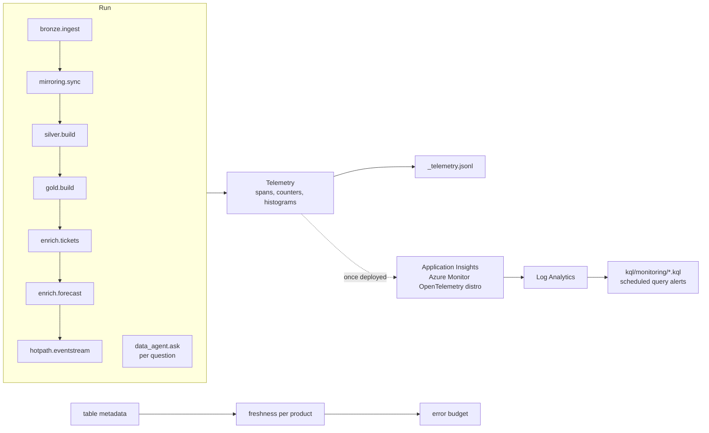

# Observability and reliability

**Purpose.** Operators need to know three things without reading code: did the pipeline run and
how long did each step take, is each data product as fresh as its owner promised, and how is the
data agent being used (and attacked). Telemetry uses OpenTelemetry names so the same records can
go to Application Insights unchanged.

## Architecture



## How it works

1. `Telemetry.span(name, **attrs)` times a block, nests it under the current span, sets status
   `ok` or `error` (with `exception.type`) and records `fabricbi.step.duration` for it.
2. `add()` increments a counter and `record()` adds a histogram value, both keyed by attributes.
3. At the end of `run_all()` the pipeline writes every span, counter and histogram to
   `<lake>/_telemetry.jsonl`, one JSON object per line.
4. `freshness(product, last_publish, now)` returns `ok` while the newest publish is younger than
   80% of the product's limit, `warning` up to the limit, and `breach` beyond it or if the product
   never published.
5. `error_budget(statuses, target=0.99)` counts breaches over a series of checks; `burn` is
   breaches divided by the allowed number (1% of checks), and `met` is false once it passes 1.

## Signals

| Signal | Name | Attributes |
|---|---|---|
| span | `bronze.ingest`, `silver.build`, `gold.build` | `fabricbi.layer` |
| span | `mirroring.sync` | `db.system=sqlite` |
| span | `enrich.tickets` | `gen_ai.system=foundry-mock` |
| span | `enrich.forecast` | `ml.framework=scikit-learn` |
| span | `hotpath.eventstream` | `messaging.system=eventhubs` |
| span | `data_agent.ask` (per question, at query time) | `enduser.id`, `gen_ai.system` |
| counter | `fabricbi.rows.written` | `table` (`layer.table`), `fabricbi.layer` |
| counter | `fabricbi.rows.quarantined` | `table` |
| counter | `fabricbi.hotpath.late_events` | none |
| counter | `fabricbi.agent.queries` | `outcome`, `reason` |
| histogram | `fabricbi.step.duration` (ms) | `step` |
| histogram | `fabricbi.agent.duration` (ms) | `outcome` |

## Key files

| File | What it does |
|---|---|
| [`observability/telemetry.py`](../src/fabricbi/observability/telemetry.py) | `Telemetry`, `Span`, `export_jsonl` |
| [`observability/slo.py`](../src/fabricbi/observability/slo.py) | `freshness`, `error_budget` |
| [`context.py`](../src/fabricbi/context.py) | `RunContext.write` adds `fabricbi.rows.written` for every table |
| [`kql/monitoring/`](../kql/monitoring/README.md) | Log Analytics queries for alerts and dashboards |
| [`infra/terraform/modules/monitoring`](../infra/terraform/modules/monitoring/README.md) | Log Analytics workspace and Application Insights |

## Code excerpts

Span status and duration:

<!-- excerpt: src/fabricbi/observability/telemetry.py -->
```python
        try:
            yield sp
            sp.status = "ok"
        except Exception as exc:
            sp.status = "error"
            sp.attributes["exception.type"] = type(exc).__name__
            raise
```

The freshness rule:

<!-- excerpt: src/fabricbi/observability/slo.py -->
```python
    status = "ok" if age <= 0.8 * limit else ("warning" if age <= limit else "breach")
```

## Configuration and parameters

| Setting | Value |
|---|---|
| Service name | `fabric-enterprise-bi` (`Telemetry.service`, `AppRoleName` in the KQL) |
| Freshness limits | `slo.freshness_hours` in each product contract (26 h, 0.25 h, 48 h, 26 h, 26 h) |
| Warning threshold | 80% of the limit |
| SLO target | 99% of checks (`error_budget(target=0.99)`) |
| Log Analytics | retention and daily cap per environment in `infra/terraform/envs/*.tfvars` (dev: 1 GB a day) |

## Run it locally

```bash
python -m fabricbi.examples observability
python scripts/demo.py && head -3 .onelake-demo/lake/_telemetry.jsonl   # the exported records
```

<!-- example: observability -->
```text
spans: ['bronze.ingest', 'mirroring.sync', 'silver.build', 'gold.build', 'enrich.tickets', 'enrich.forecast', 'hotpath.eventstream']
span status: ['ok']
fabricbi.rows.written total: 252,646
fabricbi.rows.quarantined: 2
fabricbi.hotpath.late_events: 48
retail-sales published 12 h ago -> ok
retail-sales published 24 h ago -> warning
retail-sales published 30 h ago -> breach
error budget, 2 breaches in 300 checks at 99%: {'checks': 300, 'breaches': 2, 'allowed': 3.0, 'burn': 0.67, 'met': True}
error budget, 5 breaches in 300 checks at 99%: {'checks': 300, 'breaches': 5, 'allowed': 3.0, 'burn': 1.67, 'met': False}
```

Rows written (252,646) is the sum over every bronze, silver and gold table in one run.

## Alerting queries (written, not deployed)

| Query | Alert |
|---|---|
| [`freshness_slo.kql`](../kql/monitoring/freshness_slo.kql) | a data product is in breach (reads the planned `FabricBiPublish_CL` table) |
| [`pipeline_failures.kql`](../kql/monitoring/pipeline_failures.kql) | a step failed in the last day, with its `exception.type` (`QualityGateError`, `ContractError` ...) |
| [`agent_queries.kql`](../kql/monitoring/agent_queries.kql) | data agent outcomes per day (attacks vs false refusals) |

## Tests and eval gates

[`tests/test_09_governance_ops.py`](../tests/test_09_governance_ops.py):

| Test | Checks |
|---|---|
| `test_pipeline_emits_telemetry` | the expected spans exist, 48 late events are counted, and `_telemetry.jsonl` holds the silver and gold spans |
| `test_freshness_statuses` | ok, warning and breach at the boundaries, and breach when never published |
| `test_error_budget` | met and missed budgets |

## Guardrails, security and governance

Telemetry carries no row data. The data agent span records the subject (`enduser.id`) so misuse
can be traced to a person; in a real deployment that is pseudonymous Entra object id, not an
email. Application Insights local authentication is a variable and can be switched off in prod in
favour of managed identity.

## Failure modes

| Failure | What the operator sees |
|---|---|
| Quality gate or contract check fails | `silver.build` or `gold.build` span with status `error` and `exception.type`; `pipeline_failures.kql` fires |
| Late or stuck producer | `fabricbi.hotpath.late_events` rises |
| Product not refreshed | freshness `warning`, then `breach`; error budget burns |
| Agent under attack | `fabricbi.agent.queries` with `outcome=refused` and reasons like `prompt_injection` |
| Agent false refusals | refusals with policy reasons on benign questions; the eval gate keeps this at 0 |

### Reliability measures in the code

- Idempotent ingest (content-hash manifest) and idempotent mirroring (upsert by key, checkpoint
  after apply).
- Contracts checked before every silver and gold write, and a quarantine-rate gate before gold.
- Late events are routed, not merged into published windows; the cold path catches them up.
- Each alert fires once per incident and clears on recovery.
- The data agent has a per-query timeout and a cost limit, and fails closed.

## On real Fabric

| Here | In Azure / Fabric |
|---|---|
| `Telemetry` | Azure Monitor OpenTelemetry distro in notebooks and the agent, exporting to Application Insights (`appi-...`) on a Log Analytics workspace (`log-...`) |
| `_telemetry.jsonl` | `AppDependencies` (spans) and `AppMetrics` (counters, histograms) tables |
| `kql/monitoring/*.kql` | Azure Monitor scheduled query alert rules with an action group |
| Freshness check | `freshness_slo.kql` over a publish log, plus Fabric's workspace monitoring Eventhouse and the capacity metrics app |

## Limitations

- Nothing is exported to Application Insights; records stay in memory and in the JSON lines file.
- The alert rules and action groups are not in the IaC yet; the queries are written but not
  deployed.
- `FabricBiPublish_CL` (the publish log `freshness_slo.kql` reads) does not exist yet; offline the
  same rule runs in `slo.py`.
- Data agent spans from interactive questions are not written to the file, because they happen
  after the run finishes.
