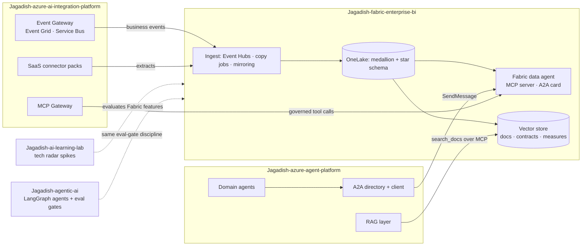

# How this repo fits the rest of the portfolio

This is the data platform piece. The other repos build agents and the integration layer; this
one gives them governed data to stand on.

| Repo | How it connects | Where to look here |
|---|---|---|
| [Jagadish-azure-agent-platform](https://github.com/jagadishmazure-jpg/Jagadish-azure-agent-platform) | Its A2A client calls the data agent with `SendMessage` and a `{skill, input}` data part; the card uses the same control-plane extension, so its directory can register it. Its RAG layer can call `search_docs` for definitions and data product facts. | [`control-plane/agent-card.json`](../control-plane/agent-card.json), [`serve/a2a.py`](../src/fabricbi/serve/a2a.py), [`serve/mcp_server.py`](../src/fabricbi/serve/mcp_server.py) |
| [Jagadish-azure-ai-integration-platform](https://github.com/jagadishmazure-jpg/Jagadish-azure-ai-integration-platform) | Its Event Gateway and SaaS connectors are upstream sources: business events land in Event Hubs, connector extracts land in the landing zone. Its MCP Gateway is where this MCP server would be registered, so tool calls get the same identity and audit handling. | [`hotpath/stream.py`](../src/fabricbi/hotpath/stream.py), [`coldpath/bronze.py`](../src/fabricbi/coldpath/bronze.py), [`control-plane/mcp-tools.json`](../control-plane/mcp-tools.json) |
| [Jagadish-ai-learning-lab](https://github.com/jagadishmazure-jpg/Jagadish-ai-learning-lab) | New Fabric features (data agents, mirroring sources, Real-Time Intelligence) are tried there first as spikes with a tech radar verdict before they are adopted here. | [`docs/best-practices.md`](best-practices.md) |
| [Jagadish-agentic-ai](https://github.com/jagadishmazure-jpg/Jagadish-agentic-ai) | The same habits: golden-set eval gates in CI, guardrails per layer, offline mocks by default. Its retail agents (refunds, customer care) are natural consumers of the sales and ticket data products. | [`evals/`](../evals), [`src/fabricbi/evals.py`](../src/fabricbi/evals.py) |

Nothing here calls those repos at test time. The contracts (card shape, JSON-RPC envelope, header
names) are what make them compatible; wiring them together needs a shared deployment, which has
not happened yet.
