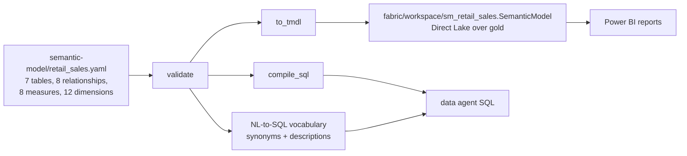

# Semantic model: one definition for Power BI and the data agent

**Purpose.** "Net sales" must mean the same thing in a Power BI report, in the data agent's answer
and in a finance spreadsheet. One YAML file defines the tables, relationships, measures and
business vocabulary once, and three things are generated from it: the Power BI semantic model in
TMDL, the SQL the data agent runs, and the words the agent understands.

## Architecture



## How it works

1. **Load.** `SemanticModel.load()` reads [`retail_sales.yaml`](../semantic-model/retail_sales.yaml).
   Each table names its gold source, its columns and types, and the key columns to hide.
2. **Validate.** `validate()` checks that every relationship column exists, that every column
   referenced inside a measure's DAX (`table[column]`) exists, that every dimension points at a
   real column, and that no synonym is used twice (an ambiguous word would make the agent guess).
3. **Compile a query plan to SQL.** A `QueryPlan` is measures, group-by dimensions, filters, an
   order, a limit and an optional start date. `compile_sql()` uses each measure's SQL form, joins
   only the dimension tables the plan needs, and refuses to mix measures from two fact tables.
4. **Export TMDL.** `to_tmdl()` renders `definition/model.tmdl`, one file per table (measures with
   descriptions and format strings, columns with types and `isHidden`, a Direct Lake partition)
   and `definition/relationships.tmdl`.
   [`scripts/export_contracts.py`](../scripts/export_contracts.py) writes them into the workspace
   folder and CI runs it with `--check`, so the committed TMDL can never drift from the YAML.
5. **Feed the agent.** The NL-to-SQL step matches the question against measure and dimension
   synonyms ([data-agent.md](data-agent.md)); measures with `requires_role` are refused for
   callers without that role.

## Measures

| Measure | DAX | Restricted |
|---|---|---|
| Net Sales | `SUM(fact_sales[net_amount])` | no |
| Units | `SUM(fact_sales[qty])` | no |
| Transactions | `DISTINCTCOUNT(fact_sales[txn_id])` | no |
| Average Basket | `DIVIDE([Net Sales], [Transactions])` | no |
| Gross Margin | `SUM(fact_sales[net_amount]) - SUM(fact_sales[cost_amount])` | `finance` role |
| Average Freezer Temp | `AVERAGE(fact_freezer_daily[avg_temp_c])` | no |
| Warm Hours | `SUM(fact_freezer_daily[hours_above_threshold])` | no |
| Tickets | `COUNTROWS(fact_ticket)` | no |

Dimensions: region, store, city, category, brand, product, day_of_week, week, month, tier,
ticket_category, device.

## Key files

| File | What it does |
|---|---|
| [`semantic-model/retail_sales.yaml`](../semantic-model/retail_sales.yaml) | The single definition |
| [`src/fabricbi/serve/semantic.py`](../src/fabricbi/serve/semantic.py) | `SemanticModel`: load, validate, `compile_sql`, `to_tmdl` |
| [`scripts/export_contracts.py`](../scripts/export_contracts.py) | Writes the TMDL (and the agent card, MCP tool list and KQL database schema); `--check` for CI |
| [`fabric/workspace/sm_retail_sales.SemanticModel/`](../fabric/workspace/sm_retail_sales.SemanticModel/definition) | Generated TMDL in the Fabric Git-integration layout |

## Code excerpts

A measure in the YAML, with the forms each consumer uses:

<!-- excerpt: semantic-model/retail_sales.yaml -->
```yaml
  - name: Gross Margin
    table: fact_sales
    dax: SUM(fact_sales[net_amount]) - SUM(fact_sales[cost_amount])
    sql: ROUND(SUM(fact_sales.net_amount) - SUM(fact_sales.cost_amount), 2)
    format: "\\$#,0.00"
    description: Net sales minus cost of goods. Finance only.
    synonyms: [gross margin, margin, profit]
    requires_role: finance
```

Only the needed dimensions are joined:

<!-- excerpt: src/fabricbi/serve/semantic.py -->
```python
        need = []
        for d in dims + filt_dims:
            t = d["column"].split(".")[0]
            if t != fact and t not in need:
                need.append(t)
```

The same measure in the generated TMDL:

<!-- excerpt: fabric/workspace/sm_retail_sales.SemanticModel/definition/tables/fact_sales.tmdl -->
```text
	/// Net sales minus cost of goods. Finance only.
	measure 'Gross Margin' = SUM(fact_sales[net_amount]) - SUM(fact_sales[cost_amount])
		formatString: \$#,0.00
```

## Configuration and parameters

| Key | Meaning |
|---|---|
| `storage_mode: directLake` | Every table partition is Direct Lake over the gold Delta table |
| `culture: en-US` | Model culture in `model.tmdl` |
| `tables.<t>.source` | `schema.table` in the Lakehouse (`gold.fact_sales`) |
| `tables.<t>.hidden` | Key columns hidden from report authors |
| `measures[].requires_role` | Role needed to use the measure |
| `measures[].synonyms`, `dimensions[].synonyms` | Words the agent matches; must be unique |

## Run it locally

```bash
python -m fabricbi.examples semantic
python scripts/export_contracts.py          # rewrite the TMDL from the YAML
python scripts/export_contracts.py --check  # what CI runs
```

<!-- example: semantic -->
```text
tables 7, measures 8, dimensions 12, relationships 8
validation errors: []
SELECT dim_store.region AS region, ROUND(SUM(fact_sales.net_amount), 2) AS "Net Sales"
FROM fact_sales
JOIN dim_store ON fact_sales.store_key = dim_store.store_key
JOIN dim_product ON fact_sales.product_key = dim_product.product_key
WHERE dim_product.category = 'Dairy'
GROUP BY dim_store.region
ORDER BY "Net Sales" DESC, dim_store.region
LIMIT 3
TMDL files: ['definition/model.tmdl', 'definition/relationships.tmdl', 'definition/tables/dim_customer.tmdl', 'definition/tables/dim_date.tmdl', 'definition/tables/dim_product.tmdl', 'definition/tables/dim_store.tmdl', 'definition/tables/fact_freezer_daily.tmdl', 'definition/tables/fact_sales.tmdl', 'definition/tables/fact_ticket.tmdl']
```

The example plan is "net sales by region for Dairy, top 3". `dim_product` is joined only because
of the category filter.

## Tests and eval gates

[`tests/test_07_semantic_agent.py`](../tests/test_07_semantic_agent.py):

| Test | Checks |
|---|---|
| `test_semantic_model_is_valid` | the shipped model has no validation errors |
| `test_semantic_model_catches_broken_measure` | a measure pointing at a missing column is reported |
| `test_compile_only_joins_needed_dimensions` | net sales by region joins `dim_store` and not `dim_product` |
| `test_tmdl_export_has_tables_measures_and_relationships` | the export has the model, relationships and measure definitions |

The 22-question NL-to-SQL golden set (gate 0.9) runs through `compile_sql`, so a broken measure
also fails the eval gate. CI's `export_contracts.py --check` fails if the TMDL is stale.

## Guardrails, security and governance

- Finance-only `Gross Margin` is marked with `requires_role: finance`; `unit_cost` and
  `cost_amount` are hidden from other roles by the agent's session ([data-agent.md](data-agent.md)).
- `dim_store.region` is the row-level security key; `dim_customer.email` and `phone` are masked
  unless the caller has `pii_reader`.
- Measure descriptions are also indexed in the vector store, so agents can look up definitions
  instead of guessing.

## Observability

The data agent's span records the measures each answer used. In Fabric, Power BI query activity
for the model appears in the capacity metrics app and workspace monitoring.

## Failure modes

| Failure | Handling |
|---|---|
| A gold column is renamed | `validate()` reports the broken relationship, dimension or measure; tests fail |
| Two items share a synonym | `validate()` reports it, so the agent never has to guess |
| A plan mixes measures from two facts | `compile_sql` raises; the agent answers `cannot_answer` |
| YAML changed but TMDL not regenerated | `export_contracts.py --check` fails in CI |

## On real Fabric

The generated folder follows the Power BI project (PBIP) layout that Fabric Git integration and
`fabric-cicd` read: `definition.pbism` plus TMDL files under `definition/`. Publishing it creates
the `sm_retail_sales` semantic model in Direct Lake mode over the `lh_retail` gold tables
([fabric-items.md](fabric-items.md)). Roles for row-level security and object-level security
would be defined as TMDL `role` objects with a DAX filter on `dim_store[region]`.

## Limitations

- RLS, OLS and masking are enforced by the data agent's session, not exported as TMDL roles yet.
- The TMDL has not been opened in Power BI Desktop or deployed to a workspace; its structure is
  checked by tests only.
- There are no report (`.Report`) items; the model is the deliverable.
- `validate()` checks column references in DAX, not DAX syntax.
